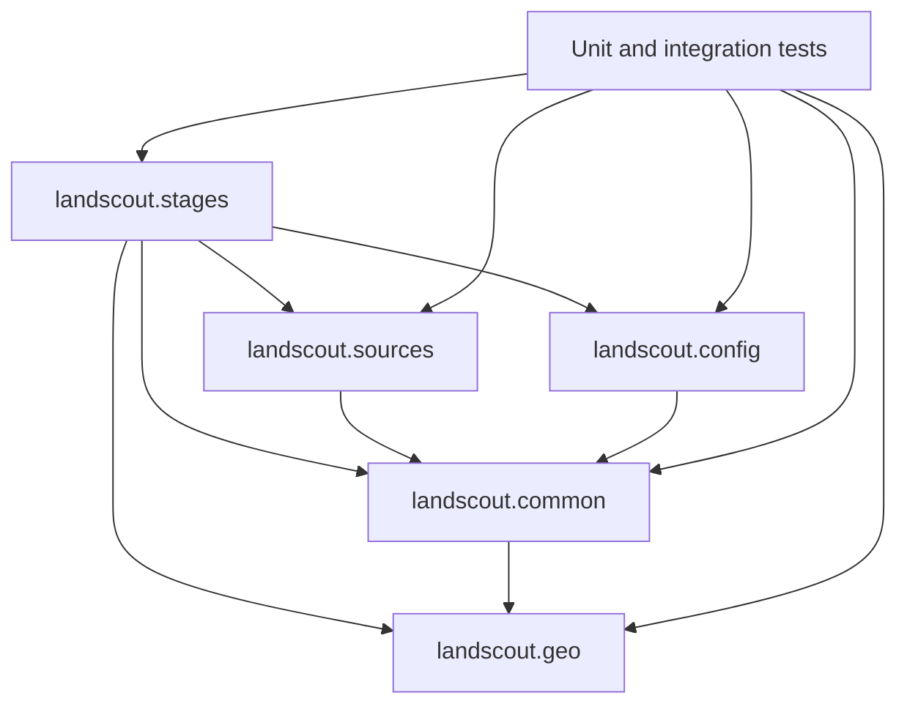

# LandScout architecture

## Product scope

LandScout is a BESS-first, evidence-led land-origination and preliminary-analysis codebase. Muret is the proving ground for current Cadastre, IGN BD TOPO, RTE/ODRÉ, GPU/PLU, CNIG, road-proxy, and PatriNat/INPN source foundations. The code separates physical source acquisition, factual normalization, spatial analysis, policy/precheck evidence, and diagnostics so that a downstream consumer cannot silently substitute a policy conclusion for a fact.

The implemented repository does not yet provide a global parcel score, owner/contact workflow, export/delivery product, or autonomous land decision. In the conceptual product sequence `SCAN -> FILTER -> ANALYZE -> SCORE -> IDENTIFY -> EXPORT -> HUMAN`, current code implements source scanning/acquisition, cadastral factual filters, and several analysis/precheck paths. SCORE, IDENTIFY, and product EXPORT are not implemented by the tracked Python modules.

## Current major layers

### `src/landscout/common`

Internal shared contracts: duplicate-rejecting strict YAML/JSON parsing, deeply immutable mapping support, safe HTTPS transport, portable artifact paths, deterministic frame signatures, canonical Cadastre validation, planning overlay tolerance, planning text mapping, canonical planning schemas, and intrinsic planning relation/application checks. `common` does not import `landscout.stages`; it is not wholly dependency-bottom, because `common.cadastre_contract` imports `geo.crs`.

### `src/landscout/config.py` and `configs/`

Pydantic models load scan/profile configuration. Source adapters and policy compilers have their own strict checked-in YAML models. Trust-bearing YAML rejects duplicate keys, decision-input models are frozen, and every reachable ordered sequence, set, and mapping is recursively copied into tuple, frozenset, or a backing-alias-free immutable mapping. Integrity mappings persisted as strict JSON additionally reject bytes, mutable/custom objects, mapping views, sets, NumPy values, non-finite numbers, cycles, non-string keys, and every other non-canonical leaf rather than retaining or stringifying them. Public source boundaries still reconstruct and revalidate configuration from canonical model data rather than trusting a supplied instance. Configuration is an input identity; it does not prove downloaded bytes until an adapter validates those bytes.

### `src/landscout/geo`

Canonical PyProj CRS objects and parcel geometry calculations. Metric geometry work uses EPSG:2154 calculation copies. Storage geometry is preserved unless a result contract explicitly says otherwise.

### `src/landscout/sources`

External-source trust boundaries for Cadastre, RTE/ODRÉ, IGN BD TOPO, GPU, and PatriNat/INPN. These modules own source-specific URL/config identity, downloads, cache integrity, archive/extraction checks, physical layer discovery, and source result envelopes.

### `src/landscout/stages`

Factual normalization, spatial enrichment, profiling, policy compilation/application, source-bound artifact loading, aggregation, and diagnostics. Stable high-level symbols are re-exported by `landscout.stages`; private frame-only helpers are not the production trust root.

### `tests/unit`

Unit and regression tests use strict synthetic data, temporary files, synthetic GeoPackages/Parquets, monkeypatched network/DNS/filesystem operations, controlled corruption, and selected cached-source checks. Each companion test document states its actual boundary.

## Dependency direction

Arrows below mean **consumer imports dependency**, not data movement. They summarize directly observed cross-layer Python imports; same-layer imports and individual package initializer re-exports are omitted. Checked-in YAML is input data, not a Python import edge. `config.py` is the scan/profile model module; source and policy models live with their own implementations.

The common-to-geo edge is specifically `common.cadastre_contract -> geo.crs`, not an import from geometry utilities back into common. The earlier diagram mixed opposite arrow meanings and implied that reverse import. The common planning overlay implementation avoids a common-to-stages cycle. Source adapters depend on `common.safe_http`, but the shared transport does not know source-specific datasets, hashes or business meaning. Qualified monkeypatch callbacks, framework validators and third-party receiver calls are not exhaustively resolved by this static graph; important public paths are reviewed in source/tests and the per-file ledger.

## Implemented functional chain

```mermaid
flowchart LR
    External[Official external source] --> Acquire[Acquire or reuse verified cache]
    Acquire --> Physical[Verify bytes archive extraction and layer]
    Physical --> Normalize[Normalize factual schema]
    Normalize --> Analyze[Spatial factual or proxy analysis]
    Analyze --> Policy[Checked-in policy or diagnostic precheck where implemented]
    Policy --> Result[Result evidence and explicit validation]
    Result -. future only .-> Score[Global scoring not implemented]
    Score -. future only .-> Identify[Owner identification not implemented]
    Identify -. future only .-> Export[Delivery export not implemented]
```

This is a conceptual phase overview, not one implemented caller chain: road classification precedes parcel proximity, and EP currently stops at source evidence plus a separate non-runtime research dossier. Exact public objects and owned calls are in [DATA_FLOW](DATA_FLOW.md). The planning chain is branched: zoning geometry, planning-feature relations, written regulation text/structure, CNIG feature meaning, written-zoning policy, and CNIG feature policy stay distinct until explicitly coded application/aggregation stages.

Frozen result envelopes may retain mutable Pandas/GeoPandas frames; they are not all deeply immutable trust configurations. Their validators check those frames at the relevant boundary. The INPN profile/bundle records and loaded configuration/policy collections have different immutable representation contracts.

## Public source and physical-integrity boundaries

- Cadastre loading binds the exact official commune URL/filename and physical gzip to `CadastreParcelSource`. Normalization source-completely revalidates that object, rereads the gzip, exact-compares the supplied frame, and derives output from the fresh frame.
- IGN grid/road normalizers consume source dataclasses plus `IgnBdTopoSourceConfig`, reproduce globally distinct configured logical roles from the verified extraction, exact-compare fresh physical frames/summaries, and derive output only from the fresh objects.
- Public grid/road proximity APIs accept source objects rather than arbitrary normalized frames or upstream result tables.
- GPU planning stages consume `GpuPlanningDocument`, validate its retained canonical source-config identity/hash, and revalidate referenced extraction files, configured logical roles, and spatial layers through their integrity envelopes.
- BESS application artifact loaders require exact upstream result objects and deterministically rebuild expected output before exact comparison.
- Independent source-complete validators remain separate from lightweight result-envelope validators.

## Trust boundaries

Textual values such as URL, provider, archive name, layer, SHA string, profile ID, or source document ID are lineage. They become physical proof only when the current boundary hashes/validates physical bytes and, where required, rereads and exact-compares physical rows, schema, CRS, geometry, order, and summaries. See [SOURCE_TRUST_MODEL.md](SOURCE_TRUST_MODEL.md).

## Business boundaries

- A grid feature or distance is not capacity, a connection offer, cost, or feasibility.
- A road geometry/class/distance is not legal access or heavy/construction-vehicle evidence.
- A planning relation or precheck is not authorization or prohibition.
- A protected-area archive inventory is not category interpretation, parcel intersection, exclusion, or environmental suitability.
- Cadastral identifiers and geometry do not provide verified owner/contact data.

## Current unimplemented product areas

No tracked module implements global multi-criterion combination, parcel ranking, a BESS suitability score, ownership/contact enrichment, legal determination, grid capacity assessment, road easement/legal access assessment, environmental category/parcel evaluation, production export workflow, or autonomous human-replacing decision.

The supported application interfaces are Python library APIs and re-exports, not a LandScout HTTP service or declared command-line entry point. There is no end-to-end scheduler/orchestrator in the checked-in application. Source HTTP endpoints belong to external providers; package/native dependencies and their allowed-versus-locked versions are separate from those remote APIs.
