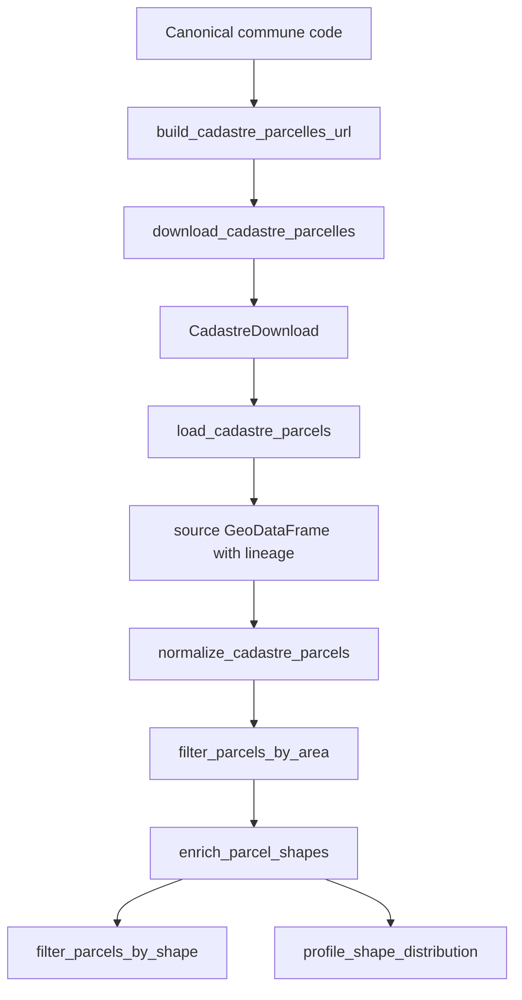

# Cadastre pipeline

## Implemented flow

## Acquisition

`build_cadastre_parcelles_url` validates a canonical French commune identifier, derives the department path (including Corsican handling), and builds the official Etalab Cadastre parcels gzip URL. `download_cadastre_parcelles` uses shared safe HTTPS, streams exact bytes, validates gzip, computes size/SHA, and creates a frozen `CadastreDownload`. See [CACHE_AND_RECOVERY.md](CACHE_AND_RECOVERY.md) for hit/refresh/rollback behavior.

## Source-complete load

`load_cadastre_parcels(download)` accepts the result object rather than a caller path. It validates exact dataclass type and lineage fields, hashes/validates the physical gzip before parsing, parses the GeoJSON with GeoPandas, validates the expected geometry column/types and nonempty dataset, adds source identity columns, and checks the archive again after parsing. This closes coordinated in-memory or read-time byte replacement gaps.

## Normalization

`normalize_cadastre_parcels` requires a spatial GeoDataFrame in EPSG:4326 and the exact cadastral identity fields. It validates unique exact parcel IDs and canonical commune identities. Output uses deterministic row order/index and preserves source geometry/CRS.

Key normalized fields include:

| Column | Meaning |
|---|---|
| `parcel_id` | Stable exact source parcel identifier used throughout downstream joins. |
| `commune_code` | Canonical French INSEE commune identity copied from validated source context. |
| `geometry_status` | Exact `VALID` or `INVALID`; null, empty, invalid, or unsupported source geometry is not repaired. |
| `area_m2` | Area of valid Polygon/MultiPolygon calculated on an EPSG:2154 copy; null on invalid rows. |
| source identity fields | Exact provider/source/document/download lineage introduced by the loader and preserved by normalization. |
| `geometry` | Original active EPSG:4326 source geometry. |

## Area filter

`filter_parcels_by_area` validates the exact `geometry_status` vocabulary before masks. It validates parcel IDs, CRS, duplicate columns, and physically valid `area_m2` values on `VALID` rows. Configured minimum and maximum area bounds produce explicit factual columns/statuses. Invalid geometry and out-of-bound area are recorded under the function's closed domain; no ranking occurs.

## Shape enrichment

`enrich_parcel_shapes` validates the normalized/area-filtered envelope and exact geometry-status values. For valid geometries it creates EPSG:2154 calculation copies and adds:

- `length_m` and `width_m` from the minimum rotated rectangle;
- `length_width_ratio`;
- `compactness`;
- centroid longitude/latitude derived from the geometric centroid transformed to EPSG:4326;
- shape calculation/status/error evidence.

Invalid source geometry is preserved and receives null shape metrics plus explicit diagnostic state. The input is not mutated.

## Shape screening and profiling

`filter_parcels_by_shape` applies the configured scenario thresholds to already computed metrics and records explicit screening results. It does not recalculate geometry or infer planning/access/grid/environment meaning. `profile_shape_distribution` validates physical metric domains, excludes error rows from percentiles/buckets, and returns frozen profile dataclasses with scenario counts/percentages.

## GIS rules

- Storage parcel CRS: EPSG:4326.
- Metric calculation CRS: EPSG:2154.
- Supported valid geometry: Polygon/MultiPolygon.
- No silent repair or row drop in normalization/enrichment.
- Minimum rotated rectangle dimensions are factual geometric proxies, not a usable BESS footprint.

## Errors and tests

Controlled errors are `CadastreDownloadError`, loader-specific errors, `CadastreNormalizationError`, `ParcelFilterError`, `ShapeEnrichmentError`, and `ShapeProfileError`. The companions for `test_cadastre_fr.py`, `test_cadastre_loader_fr.py`, `test_normalize_cadastre.py`, `test_filter_parcels.py`, `test_filter_shape.py`, `test_enrich_shape.py`, and `test_profile_shape.py` map every test and failure injection.

## Explicit non-goals

This pipeline does not prove ownership/contact details, legal title, buildability, planning authorization, grid/road/environment suitability, or a BESS score. A kept parcel is only one that passed the coded factual area/shape screens.
