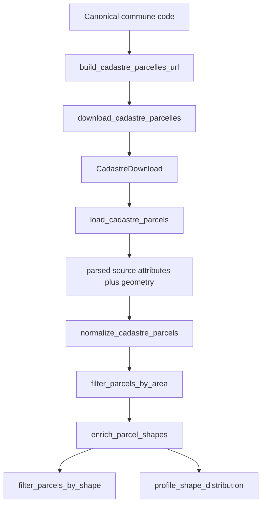

# Cadastre pipeline

## Implemented flow

## Acquisition

`build_cadastre_parcelles_url` validates a canonical French commune identifier, derives the department path (including Corsican handling), and builds the official Etalab Cadastre parcels gzip URL. `download_cadastre_parcelles` uses shared safe HTTPS, streams exact bytes, validates gzip, computes size/SHA, and creates a frozen `CadastreDownload`. See [CACHE_AND_RECOVERY.md](CACHE_AND_RECOVERY.md) for hit/refresh/rollback behavior.

## Source-complete load

`load_cadastre_parcels(download)` accepts the result object rather than a caller path. `_validate_download` requires the exact `CadastreDownload` runtime type, a real `Path`, an existing file, an exact non-empty source URL with an `http` or `https` scheme, filename/path agreement, strict positive size, and canonical lowercase SHA256. It compares current physical size/SHA, fully reads the gzip to validate it, parses GeoJSON with GeoPandas, rejects an empty dataset/missing active geometry/non-polygon types, and compares size/SHA again after parsing. It does **not** independently pin `cadastre.data.gouv.fr` and does **not** append source identity/URL/timestamp/hash fields to the returned frame.

## Normalization

`normalize_cadastre_parcels` requires a spatial GeoDataFrame in EPSG:4326 and the exact cadastral identity fields. It validates unique exact parcel IDs and canonical commune identities. Output preserves input row order and index labels plus source geometry/CRS; it does not add download lineage.

The complete ordered output has exactly 12 columns:

| Position | Column | Source/calculation and contract |
|---:|---|---|
| 1 | `parcel_id` | Etalab `id`; exact non-empty string, unique. |
| 2 | `commune_code` | Etalab `commune`; canonical French INSEE string. |
| 3 | `section_prefix` | Etalab `prefixe`; exact non-empty string. |
| 4 | `section` | Etalab `section`; exact non-empty string. |
| 5 | `parcel_number` | Etalab `numero`; exact non-empty string. |
| 6 | `source_contenance` | Etalab `contenance`, value/null/dtype preserved; all-null column inserted if absent. |
| 7 | `source_arpente` | Etalab `arpente`, value/null/dtype preserved; all-null column inserted if absent. |
| 8 | `source_created_at` | Etalab `created`, value/null/dtype preserved; all-null column inserted if absent. |
| 9 | `source_updated_at` | Etalab `updated`, value/null/dtype preserved; all-null column inserted if absent. |
| 10 | `geometry_status` | Non-null and exactly `VALID` or `INVALID`; source geometry is never repaired. |
| 11 | `area_m2` | `float64`; finite positive area on an EPSG:2154 calculation copy for VALID rows, NaN for INVALID rows. |
| 12 | `geometry` | Original active EPSG:4326 Polygon/MultiPolygon geometry, including preserved null/empty/invalid values. |

## Area filter

`filter_parcels_by_area` validates the exact `geometry_status` vocabulary before masks. It validates parcel IDs, CRS, duplicate columns, and strict positive finite `area_m2` on `VALID` rows. Candidates preserve the input schema. Rejected rows append `rejection_reason`, exactly one of `AREA_UNKNOWN`, `INVALID_GEOMETRY`, `AREA_BELOW_MIN`, or `AREA_ABOVE_MAX`. Both subsets preserve their source-relative order and original index labels. The configured minimum/maximum are policy thresholds, not geometry measurements; no ranking occurs.

## Shape enrichment

`enrich_parcel_shapes` validates the normalized/area-filtered envelope and exact geometry-status values. For valid geometries it creates EPSG:2154 calculation copies and adds:

- `length_m` and `width_m` from the minimum rotated rectangle;
- `length_width_ratio`;
- `compactness`;
- centroid longitude/latitude derived from the geometric centroid transformed to EPSG:4326;
- `shape_status`, initialized to `ERROR` and changed to `VALID` only after every measurement succeeds.

All input columns/values and row order are preserved, but the result index is reset to RangeIndex. Invalid/non-measurable source geometry is preserved and receives NaN for all six metrics plus `shape_status=ERROR`. The input is not mutated.

## Shape screening and profiling

`filter_parcels_by_shape` applies the configured scenario thresholds to already computed metrics. When disabled, retained is an unchanged copy of every input row and rejected is an empty same-schema copy; no policy columns are added. When enabled, both outputs append `shape_policy_version`, `shape_policy_min_width_m`, and `shape_policy_max_ratio`; rejected rows also append `shape_rejection_reason` (`RATIO_ABOVE_MAX`, `WIDTH_BELOW_MIN`, or `SHAPE_ERROR`). It preserves each subset's input order/index and does not recalculate geometry or infer planning/access/grid/environment meaning. `profile_shape_distribution` validates physical metric domains, excludes error rows from percentiles/buckets, and returns frozen profile dataclasses with scenario counts/percentages.

## GIS rules

- Storage parcel CRS: EPSG:4326.
- Metric calculation CRS: EPSG:2154.
- Supported valid geometry: Polygon/MultiPolygon.
- No silent repair or row drop in normalization/enrichment.
- Minimum rotated rectangle dimensions are factual geometric proxies, not a usable BESS footprint.

## Errors and tests

Controlled errors are `CadastreDownloadError`, loader-specific errors, `CadastreNormalizationError`, `ParcelFilterError`, `ShapeEnrichmentError`, and `ShapeProfileError`. The companions for `test_cadastre_fr.py`, `test_cadastre_loader_fr.py`, `test_normalize_cadastre.py`, `test_filter_parcels.py`, `test_filter_shape.py`, `test_enrich_shape.py`, and `test_profile_shape.py` map every test and failure injection.

## Explicit non-goals

This pipeline does not prove ownership/contact details, legal title, buildability, planning authorization, grid/road/environment suitability, or a BESS score. A kept parcel is only one that passed the coded factual area/shape screens.
