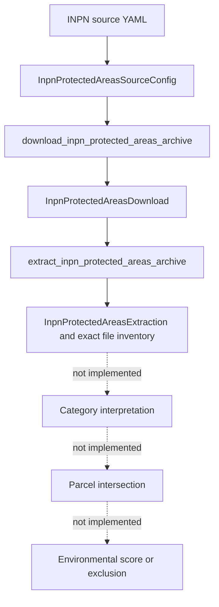

# Environment pipeline

## Current implemented scope

The environment domain currently implements only acquisition, exact snapshot verification, safe caching/extraction, and complete file inventory for the PatriNat/INPN protected-areas reference archive. No production module opens those GeoPackages for environmental semantics or parcel analysis.

## Source identity

The checked-in source configuration declares:

- provider: PatriNat;
- authority: MNHN;
- program: INPN;
- dataset ID: `EP`;
- dataset name: the French protected-areas reference base named in the YAML;
- declared version: `07/2026`;
- official PatriNat reference page;
- official `assets.patrinat.fr` archive URL;
- archive filename: `EP.zip`;
- expected archive size: 99,835,011 bytes;
- expected SHA256: `73688bc37205a5e7f59e2065a0b81fc8cf2a242bdec5d7d2786f083671c4abe5`;
- configured cache root under `.cache/landscout/inpn/protected_areas`.

The strict frozen Pydantic config forbids extra fields and validates exact source identity, version/filename, HTTPS URLs, path safety, positive size, and canonical lowercase hash.

## Download validation

`download_inpn_protected_areas_archive`:

1. revalidates the exact config object;
2. validates timeout before cache/network;
3. derives the versioned dataset cache paths;
4. returns only a byte-verified strict metadata cache hit;
5. otherwise uses shared safe HTTPS and streams exact response bytes;
6. requires HTTP content consistent with a nonempty safe ZIP;
7. validates complete member destinations and CRC/content before publication;
8. requires exact configured size and SHA256;
9. creates immutable source lineage and schema-v1 metadata;
10. transactionally publishes archive and sidecar with recovery preservation.

Cache hits perform no DNS or HTTP because cache verification precedes the transport call.

## ZIP safety

All members are validated before any extraction. The implementation normalizes POSIX/Windows separators and rejects traversal, absolute/drive/UNC paths, empty destinations, control/forbidden characters, trailing dot/space, Windows reserved names (including superscript COM/LPT forms), duplicate/casefold/normalized collisions, file-directory ancestor conflicts, encrypted entries, symlinks, FIFOs, sockets/devices, and collisions with the extraction marker. `ZipFile.testzip()` and member reads enforce archive integrity.

Extraction never calls `extractall`; validated regular members are streamed to exclusive targets below a fresh temporary root.

## Inventory and extraction cache

`InpnProtectedAreasExtractedFile` carries canonical POSIX relative path, exact byte size, and SHA256. The schema-v1 extraction marker binds archive SHA/size and the exact lexically ordered tuple of all regular files. Validation rescans the entire tree, rejects links/junctions/special files, hashes every regular file except the marker, and exact-compares the inventory so that same-size content changes, size changes, missing/renamed/extra files, and forged marker values invalidate reuse.

Directory rebuild completes and validates under `.part` while the old cache remains intact, then publishes transactionally with `.bak` rollback. Recovery material is preserved on rollback failure.

## Current factual result

The approved snapshot contains 15 regular extracted files recorded by path/size/SHA. Their `.gpkg` suffix is an inventory fact only. The source adapter does not classify protected-area categories or open GIS layers.

## Explicitly not implemented

- protected-area category semantics;
- Natura 2000 interpretation;
- ZNIEFF interpretation;
- protected-area geometry/layer selection;
- parcel intersection or distance;
- environmental evidence policy;
- exclusion or suitability decision;
- environmental or global score;
- parcel rejection/ranking.

Future environmental work must start from this exact source-bound extraction and introduce its own reviewed category, geometry, CRS, provenance, and parcel-analysis contracts; this document does not invent them.
