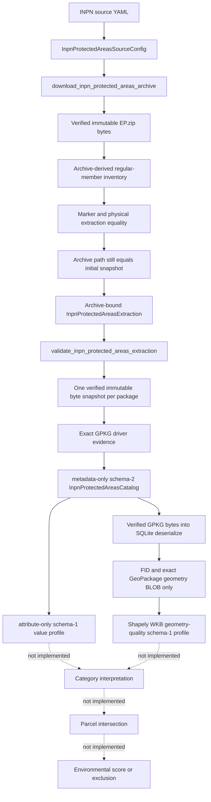

# Environment pipeline

## Current implemented scope

The environment domain currently implements acquisition, exact snapshot verification, safe caching/extraction, complete file inventory, metadata-only physical GeoPackage cataloging, a complete non-geometry attribute-value profile, and a separate geometry technical-quality profile for the PatriNat/INPN protected-areas reference archive. Both profiles derive from verified immutable package bytes. Geometry profiling reads only physical FIDs and geometry BLOBs; it does not assign environmental semantics, normalize geometry, or perform parcel analysis.

## Source identity

The checked-in source configuration declares:

- provider: PatriNat;
- authority: MNHN;
- program: INPN;
- dataset ID: `EP`;
- dataset name: the French protected-areas reference base named in the YAML;
- declared version: `07/2026`;
- official PatriNat reference page;
- official `assets.patrinat.fr` archive URL;
- archive filename: `EP.zip`;
- expected archive size: 99,835,011 bytes;
- expected SHA256: `73688bc37205a5e7f59e2065a0b81fc8cf2a242bdec5d7d2786f083671c4abe5`;
- configured cache root under `.cache/landscout/inpn/protected_areas`.

The strict frozen Pydantic config forbids extra fields and validates exact source identity, version/filename, HTTPS URLs, path safety, positive size, and canonical lowercase hash.

## Download validation

`download_inpn_protected_areas_archive`:

1. revalidates the exact config object;
2. validates timeout before cache/network;
3. derives the versioned dataset cache paths;
4. returns only a byte-verified strict metadata cache hit;
5. otherwise uses shared safe HTTPS and streams exact response bytes;
6. requires HTTP content consistent with a nonempty safe ZIP;
7. validates complete member destinations and CRC/content before publication;
8. requires exact configured size and SHA256;
9. creates immutable source lineage and schema-v1 metadata;
10. transactionally publishes archive and sidecar with recovery preservation;
11. rereads the published path and requires exact equality with the validated
    pre-publication snapshot before returning.

Cache hits perform no DNS or HTTP because cache verification precedes the transport call.

## ZIP safety

All archive snapshots are opened through one controlled context manager that requires exact nonempty built-in bytes, guarantees closure, and translates constructor-time `BadZipFile`, `LargeZipFile`, `RuntimeError`, `zlib.error`, `EOFError`, and `OSError` failures to `InpnProtectedAreasSourceError` with their original cause. All members are validated before any extraction. The implementation normalizes POSIX/Windows separators and rejects traversal, absolute/drive/UNC paths, empty destinations, control/forbidden characters, trailing dot/space, Windows reserved names (including superscript COM/LPT forms), duplicate/casefold/normalized collisions, file-directory ancestor conflicts, encrypted entries, symlinks, FIFOs, sockets/devices, and collisions with the extraction marker. `ZipFile.testzip()` and member reads enforce archive integrity.

Extraction never calls `extractall`; validated regular members are streamed to exclusive targets below a fresh temporary root.

## Inventory and extraction cache

`InpnProtectedAreasExtractedFile` carries canonical POSIX relative path, exact byte size, and SHA256. The extraction validator owns the authoritative Windows-compatible relative-path grammar: absolute, driven, traversing, backslash-aliased, reserved-device, forbidden/control-character, component-edge-whitespace, trailing-dot/space, and NFKC-forbidden forms fail closed. Whitespace is rejected, not trimmed; accepted exact text is returned unchanged. Catalog, attribute-profile, and geometry-profile intrinsic validation reuse this grammar and separately require a case-insensitive `.gpkg` suffix. One verified built-in `bytes` snapshot of `EP.zip` supplies both the validated ZIP member set and the uncompressed member streams. Hashing those streams produces the authoritative lexically ordered regular-file inventory. The schema-v1 extraction marker remains cache evidence: validation requires exact archive-derived inventory == marker inventory == freshly hashed physical inventory == caller `files`. Coordinated marker/file changes, same-size content changes, size changes, missing/renamed/extra files, links, and special entries fail closed.

Directory rebuild completes and validates under `.part` while the old cache remains intact, then publishes transactionally with `.bak` rollback. A cache hit checks the live archive immediately before return; a rebuild checks it both before and after directory publication. Recovery material is preserved on rollback failure.

## Metadata-only physical catalog

`validate_inpn_protected_areas_extraction` reconstructs configuration/download authority, requires exact built-in lineage strings, performs a final archive-path postcondition after four-way inventory equality, and returns a new object whose download identity is rebuilt from validated config and verified archive state. `build_inpn_protected_areas_catalog` reads each package path once, validates that built-in `bytes` snapshot against the archive-derived size/SHA, and supplies the same bytes to `pyogrio.list_layers` and every `pyogrio.read_info(..., force_feature_count=True, force_total_bounds=True)` call. Catalog intrinsic path failures are translated to `InpnProtectedAreasCatalogError` with the source/path cause chained. A local warning boundary suppresses only Pyogrio's exact dynamic `/vsimem/pyogrio_<hex>` non-conformant-extension `RuntimeWarning`; other warnings remain visible. Each layer must still report exact driver `GPKG`. Deterministic package/layer/field order, exact feature counts and geometry-type text, raw/canonical CRS evidence, exact canonical bounds, archive/package hashes, driver identity, and aggregate counts are preserved. The full extraction is revalidated after inspection, and `validate_inpn_protected_areas_catalog` independently rebuilds and exact-compares every value.

Catalog hash schema 2 uses canonical JSON over portable factual content and includes exact package driver identity. Absolute cache/extraction paths, cache-hit state, timestamps, Python representations, and object identity are excluded. Supplied non-null bounds must be an exact four-member tuple of built-in floats; every non-null derived CRS string must be an exact built-in string.

## Attribute-only value profile

`build_inpn_protected_areas_attribute_profile` first revalidates the exact extraction and supplied schema-2 catalog, independently rebuilds a fresh catalog, and uses only fresh evidence. Each package path is resolved and hashed through the catalog's package-byte authority exactly once; the same built-in `bytes` snapshot supplies every `pyogrio.read_dataframe` call for that package. Calls explicitly request the exact catalog field list with `read_geometry=False`, `fid_as_index=True`, `use_arrow=False`, and `datetime_as_string=True`. The shared local warning context suppresses only the known byte-backed GPKG extension warning.

The reader must return an exact Pandas `DataFrame` with exact row count and ordered fields, a single unique integer FID index, and no geometry dtype; ordinary Shapely cell values are rejected during scalar canonicalization. FIDs are preserved and sorted only for canonical evidence. Every non-null scalar is represented as exact text, Boolean text, base-10 integer text, `float.hex()` text, or padded Base64; nulls are counted separately, all distinct values and frequencies are retained, and unsupported/temporal/composite/non-finite values fail closed. Immutable field/layer/profile records bind FID, column, row, catalog, archive, and complete-profile hashes; layer records intentionally retain exact portable `relative_path: str`, never an absolute filesystem `Path`. A column hash contains only its ordered FID-addressed canonical cells; field identity and dtypes are bound separately by the field record and complete profile. Intrinsic validation checks exact nested runtime types, the shared package-path grammar, package/layer/field structure and identities, inclusive FID-range capacity, domains, component-SHA syntax, recomputable empty-component hashes, aggregates, and the complete-profile hash. Profile path failures are translated with a chained cause. It cannot reconstruct non-empty component hashes without cells. The public validator cheaply compares catalog-bound facts with the fresh catalog before `read_dataframe`, then independently rebuilds every value and non-empty component hash from current package bytes. Final extraction/catalog revalidation detects persistent mutation.

## Geometry technical-quality profile

Pyogrio 0.13.0 is intentionally not used to materialize EP geometry rows: its reader drops M from measured geometries even with `force_2d=False`. Pyogrio remains the approved physical metadata-catalog reader and the existing attribute-only reader is unchanged. Geometry rows follow a separate path: verified GPKG bytes -> `sqlite3.Connection.deserialize` into an in-memory database -> exact FID and geometry-BLOB columns -> Standard GeoPackageBinary header validation -> embedded WKB -> `shapely.from_wkb(..., on_invalid="raise")`.

The SQLite snapshot is query-only, disables trusted schema when supported, never loads extensions or attaches databases, and is always closed. Metadata queries require the exact feature table, geometry column, SRS ID, Z/M declarations, and one INTEGER PRIMARY KEY rowid-alias FID. Unsupported feature views fail closed. Source values use bound parameters; identifiers preserve spelling under strict validation and double-quote escaping. No environmental attribute is selected, and no Pyogrio/GeoPandas feature reader participates in the geometry profile.

The GeoPackage `geometry_type_name` declaration must be exact built-in uppercase text from `GEOMETRY`, `POINT`, `LINESTRING`, `POLYGON`, `MULTIPOINT`, `MULTILINESTRING`, `MULTIPOLYGON`, or `GEOMETRYCOLLECTION`. The exact geometry-column row in `PRAGMA table_info` must report the identical built-in string as its SQL declared type, with no casefolding or coercion. Independently, the embedded ISO WKB root must be assignable to that declaration: `GEOMETRY` accepts all seven supported core roots; each specific declaration accepts only its matching Shapely type. Z/M does not change type assignability. SQL NULL has no root to compare; EMPTY retains its type. Non-linear/extended types remain unsupported. Intrinsic layer validation enforces the same declaration/domain relationship, even when a caller recalculates the complete profile hash.

Standard GeoPackageBinary is not embedded WKB, and neither is the parser-derived canonical WKB. The full source BLOB has its own `GP` header, signed SRS ID, flags, optional envelope, and embedded WKB with independent byte order. The parser validates header structure, envelope code/byte order/framing/length, the metadata/header SRS relationship, empty-flag agreement, and Z/M declarations. It does not verify numerical header-envelope values against WKB coordinates. XY, XYZ, XYM, and XYZM—including measured empty geometries—remain distinct. NULL is never EMPTY. Non-empty present ordinates must all be finite; invalid but parseable topology is counted with its exact Shapely validity reason, never repaired. Observed XY bounds are independently calculated from parsed coordinates and compared exactly with catalog bounds as `EXACT_MATCH`, `DIFFERENT`, or `BOTH_NULL`, without tolerance or CRS inference.

Each immutable layer profile binds source/package/catalog identity, table/FID/geometry-column metadata, FID sequence, complete geometry-type and dimension/Z/M domains, null/empty/non-empty and valid/invalid counts, coordinate totals, validity reasons, bounds, and two independent content hashes. `raw_geometry_blob_content_sha256` hashes FID-addressed exact full-BLOB SHA256 values and is toolchain-independent. `geometry_content_sha256` hashes FID-addressed state/type/dimension/Z/M/validity/reason plus parser-derived extended little-endian WKB with explicit source dimension and no SRID. No structural normalization occurs before hashing. The complete schema-1 profile hash binds all portable facts plus SQLite/Pyogrio/GDAL/Shapely/GEOS/PyProj versions and the encoding schema/contract. Exact portable `relative_path: str` lineage is retained; absolute filesystem paths, cache-hit state, execution time, connections, arrays, raw BLOBs, and geometry objects are not retained.

Intrinsic validation proves exact immutable runtime types, shared canonical package paths, grouping/identity uniqueness, ordered domains, count equations, finite bounds, digest syntax, deterministic empty hashes, and complete-hash closure. It cannot reconstruct non-empty raw/parser content hashes without geometry rows. Public validation first revalidates extraction and rebuilds the physical catalog, rejects cheap catalog/profile mismatches before SQLite geometry-row reads, and independently rebuilds every physical field/hash. Final extraction/catalog postconditions reject persistent source mutation; a temporary live-path replacement after byte capture cannot inject geometry into the deserialized snapshot.

## Current factual result

The approved snapshot contains 15 archive-derived and physical regular files; all 15 report exact driver `GPKG`. Controlled offline inspection found 15 OGR layers, 195 ordered fields, and 11,381 total rows. Catalog SHA256 remains `ba1b9be89d6b951a5c3b5d6b54d1c42f14e0c7bc6669079b1944ff2ffd4c6b34`; attribute-profile schema 1 SHA256 is `c0bfb73643f2143bd050a7b3f6f59e7ddb52cbcd0efe8612cc45adbc8bc254e8`. The attribute profile contains 36,466 null cells and 38,993 per-field distinct non-null values across two observed runtime-dtype schema groups. The earlier attribute-only verification performed zero DNS, HTTP, downloads, GeoDataFrame construction, or geometry-object reads. The `EP/sig_tadl.gpkg` combination of raw EPSG:32753 authority and bounds near 140/-66 remains an unresolved physical source consistency observation; the geometry-quality profile records raw evidence without repair, reprojection, CRS substitution, or environmental meaning.

STEP 7F.1B.3 independently profiled all 15 physical feature tables and 11,381 geometry rows from their verified SQLite snapshots. Every layer uses source FID `fid`, geometry column `geom`, declared type `MULTIPOLYGON`, and Z/M flags `0/0`. All 11,381 geometries are non-empty valid `MultiPolygon` in the complete joint dimension domain `(2, False, False)`; NULL, EMPTY, invalid, has-Z, and has-M totals are each zero. Total coordinate count is 10,281,493. Every validity domain contains only exact reason `Valid Geometry`, and every observed XY bounds tuple is `EXACT_MATCH` with its separately retained catalog bounds. This is parser/physical evidence, not proof of real-world source correctness.

Geometry-profile schema 1 complete SHA256 is `997c8c27cbbedb2860778386b3f2eb5afa9f64de6ad07e41fc67b4cec9060ee7`. The exact recorded toolchain is SQLite 3.53.1, Pyogrio 0.13.0, GDAL 3.12.4, Shapely 2.1.2, GEOS 3.13.1, and PyProj 3.7.2. Build, repeat, and independent validation gave equal evidence with zero DNS, HTTP, download, attribute projections, Pyogrio/GeoPandas feature reads, geometry repair, or reprojection. The three controlled passes used 45 SQLite snapshots and 45 feature SELECTs for 34,143 total physical row reads; one profile still represents exactly 11,381 source rows. The first build took 28.442 seconds; the controlled build/repeat/validation sequence took 89.549 seconds. Full per-layer FID/domain/bounds/raw-BLOB/parser hashes are recorded in `docs/DEV_LOG.md`.

`EP/sig_tadl.gpkg` has one valid XY MultiPolygon, SRS ID 32753, Z/M flags `0/0`, and 620 coordinates. Catalog and observed bounds both remain exactly `(140.000388639325, -66.6746135205968, 140.027762750552, -66.660531007899)`. The raw geometry-BLOB stream hash is `bc63ca714fc5abf6f6a1e147c8c208b68c0279b64943828f67eec86a18ec8789`; the parser geometry stream hash is `bed565737aaef8bf29fc28b1f5d62472d68e1adbdcc78cd7012653282ac60233`. Status remains **UNRESOLVED PHYSICAL SOURCE CONSISTENCY OBSERVATION**; exact bounds agreement does not resolve the CRS/coordinate observation.

EP is not the separate Natura 2000 reference archive and is not the separate ZNIEFF reference archive. Text resembling those datasets remains uninterpreted raw EP evidence.

## Explicitly not implemented

- protected-area category semantics;
- protected-area geometry normalization, repair, or reprojection;
- Natura 2000 interpretation;
- ZNIEFF interpretation;
- semantic protected-area geometry/layer selection;
- parcel intersection or distance;
- environmental evidence policy;
- exclusion or suitability decision;
- environmental or global score;
- parcel rejection/ranking.

Future environmental work must start from these exact source-bound catalog and profile facts and introduce its own reviewed category, geometry-selection, normalization, provenance, and parcel-analysis contracts; this document does not invent them.
