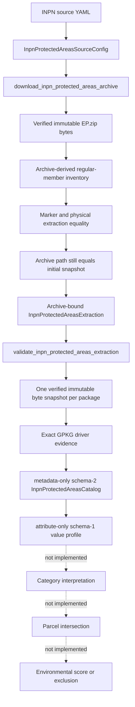

# Environment pipeline

## Current implemented scope

The environment domain currently implements acquisition, exact snapshot verification, safe caching/extraction, complete file inventory, metadata-only physical GeoPackage cataloging, and a complete non-geometry attribute-value profile for the PatriNat/INPN protected-areas reference archive. Attribute rows are read only from verified immutable package bytes; no production module reads EP geometry, assigns environmental semantics, or performs parcel analysis.

## Source identity

The checked-in source configuration declares:

- provider: PatriNat;
- authority: MNHN;
- program: INPN;
- dataset ID: `EP`;
- dataset name: the French protected-areas reference base named in the YAML;
- declared version: `07/2026`;
- official PatriNat reference page;
- official `assets.patrinat.fr` archive URL;
- archive filename: `EP.zip`;
- expected archive size: 99,835,011 bytes;
- expected SHA256: `73688bc37205a5e7f59e2065a0b81fc8cf2a242bdec5d7d2786f083671c4abe5`;
- configured cache root under `.cache/landscout/inpn/protected_areas`.

The strict frozen Pydantic config forbids extra fields and validates exact source identity, version/filename, HTTPS URLs, path safety, positive size, and canonical lowercase hash.

## Download validation

`download_inpn_protected_areas_archive`:

1. revalidates the exact config object;
2. validates timeout before cache/network;
3. derives the versioned dataset cache paths;
4. returns only a byte-verified strict metadata cache hit;
5. otherwise uses shared safe HTTPS and streams exact response bytes;
6. requires HTTP content consistent with a nonempty safe ZIP;
7. validates complete member destinations and CRC/content before publication;
8. requires exact configured size and SHA256;
9. creates immutable source lineage and schema-v1 metadata;
10. transactionally publishes archive and sidecar with recovery preservation;
11. rereads the published path and requires exact equality with the validated
    pre-publication snapshot before returning.

Cache hits perform no DNS or HTTP because cache verification precedes the transport call.

## ZIP safety

All archive snapshots are opened through one controlled context manager that requires exact nonempty built-in bytes, guarantees closure, and translates constructor-time `BadZipFile`, `LargeZipFile`, `RuntimeError`, `zlib.error`, `EOFError`, and `OSError` failures to `InpnProtectedAreasSourceError` with their original cause. All members are validated before any extraction. The implementation normalizes POSIX/Windows separators and rejects traversal, absolute/drive/UNC paths, empty destinations, control/forbidden characters, trailing dot/space, Windows reserved names (including superscript COM/LPT forms), duplicate/casefold/normalized collisions, file-directory ancestor conflicts, encrypted entries, symlinks, FIFOs, sockets/devices, and collisions with the extraction marker. `ZipFile.testzip()` and member reads enforce archive integrity.

Extraction never calls `extractall`; validated regular members are streamed to exclusive targets below a fresh temporary root.

## Inventory and extraction cache

`InpnProtectedAreasExtractedFile` carries canonical POSIX relative path, exact byte size, and SHA256. One verified built-in `bytes` snapshot of `EP.zip` supplies both the validated ZIP member set and the uncompressed member streams. Hashing those streams produces the authoritative lexically ordered regular-file inventory. The schema-v1 extraction marker remains cache evidence: validation requires exact archive-derived inventory == marker inventory == freshly hashed physical inventory == caller `files`. Coordinated marker/file changes, same-size content changes, size changes, missing/renamed/extra files, links, and special entries fail closed.

Directory rebuild completes and validates under `.part` while the old cache remains intact, then publishes transactionally with `.bak` rollback. A cache hit checks the live archive immediately before return; a rebuild checks it both before and after directory publication. Recovery material is preserved on rollback failure.

## Metadata-only physical catalog

`validate_inpn_protected_areas_extraction` reconstructs configuration/download authority, requires exact built-in lineage strings, performs a final archive-path postcondition after four-way inventory equality, and returns a new object whose download identity is rebuilt from validated config and verified archive state. `build_inpn_protected_areas_catalog` reads each package path once, validates that built-in `bytes` snapshot against the archive-derived size/SHA, and supplies the same bytes to `pyogrio.list_layers` and every `pyogrio.read_info(..., force_feature_count=True, force_total_bounds=True)` call. A local warning boundary suppresses only Pyogrio's exact dynamic `/vsimem/pyogrio_<hex>` non-conformant-extension `RuntimeWarning`; other warnings remain visible. Each layer must still report exact driver `GPKG`. Deterministic package/layer/field order, exact feature counts and geometry-type text, raw/canonical CRS evidence, exact canonical bounds, archive/package hashes, driver identity, and aggregate counts are preserved. The full extraction is revalidated after inspection, and `validate_inpn_protected_areas_catalog` independently rebuilds and exact-compares every value.

Catalog hash schema 2 uses canonical JSON over portable factual content and includes exact package driver identity. Absolute cache/extraction paths, cache-hit state, timestamps, Python representations, and object identity are excluded. Supplied non-null bounds must be an exact four-member tuple of built-in floats; every non-null derived CRS string must be an exact built-in string.

## Attribute-only value profile

`build_inpn_protected_areas_attribute_profile` first revalidates the exact extraction and supplied schema-2 catalog, independently rebuilds a fresh catalog, and uses only fresh evidence. Each package path is resolved and hashed through the catalog's package-byte authority exactly once; the same built-in `bytes` snapshot supplies every `pyogrio.read_dataframe` call for that package. Calls explicitly request the exact catalog field list with `read_geometry=False`, `fid_as_index=True`, `use_arrow=False`, and `datetime_as_string=True`. The shared local warning context suppresses only the known byte-backed GPKG extension warning.

The reader must return an exact Pandas `DataFrame` with exact row count and ordered fields, a single unique integer FID index, no geometry dtype, and no Shapely object. FIDs are preserved and sorted only for canonical evidence. Every non-null scalar is represented as exact text, Boolean text, base-10 integer text, `float.hex()` text, or padded Base64; nulls are counted separately, all distinct values and frequencies are retained, and unsupported/temporal/composite/non-finite values fail closed. Immutable field/layer/profile records bind FID, column, row, catalog, archive, and complete-profile hashes. Intrinsic validation checks exact nested runtime types, domains, ordering, counts, and canonical hash; the public validator independently rebuilds every value from current package bytes. Final extraction/catalog revalidation detects persistent mutation.

## Current factual result

The approved snapshot contains 15 archive-derived and physical regular files; all 15 report exact driver `GPKG`. Controlled offline inspection found 15 OGR layers, 195 ordered fields, and 11,381 total rows. Catalog SHA256 remains `ba1b9be89d6b951a5c3b5d6b54d1c42f14e0c7bc6669079b1944ff2ffd4c6b34`; attribute-profile schema 1 SHA256 is `c0bfb73643f2143bd050a7b3f6f59e7ddb52cbcd0efe8612cc45adbc8bc254e8`. The profile contains 36,466 null cells and 38,993 per-field distinct non-null values across two observed runtime-dtype schema groups. DNS, HTTP, downloads, GeoDataFrames, and geometry objects were all zero. The `EP/sig_tadl.gpkg` combination of raw EPSG:32753 authority and bounds near 140/-66 remains an unresolved physical source metadata consistency observation; no repair or environmental meaning is applied.

EP is not the separate Natura 2000 reference archive and is not the separate ZNIEFF reference archive. Text resembling those datasets remains uninterpreted raw EP evidence.

## Explicitly not implemented

- protected-area category semantics;
- protected-area geometry loading or normalization;
- Natura 2000 interpretation;
- ZNIEFF interpretation;
- semantic protected-area geometry/layer selection;
- parcel intersection or distance;
- environmental evidence policy;
- exclusion or suitability decision;
- environmental or global score;
- parcel rejection/ranking.

Future environmental work must start from this exact source-bound catalog and introduce its own reviewed category, geometry-selection, provenance, and parcel-analysis contracts; this document does not invent them.
