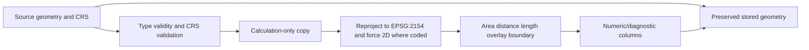

# GIS and CRS contracts

## Canonical CRSs

- `WGS84 = "EPSG:4326"` is the canonical stored parcel CRS used by Cadastre normalization and parcel result preservation.
- `LAMBERT93 = "EPSG:2154"` is the canonical metric CRS used for French mainland area, length, width, perimeter, centroid-distance, nearest-distance, intersection, and coverage-boundary calculations.
- IGN BD TOPO source layers are required to be projected Lambert-93/EPSG:2154. GPU layers must satisfy their source/normalization CRS contracts and are projected only on explicit calculation copies where needed.

Equivalent textual CRS spellings are not automatically accepted everywhere. Some physical source/result envelopes require canonical EPSG identity or exact deterministic representation because hashes/schema lineage depend on it. Each companion documents the local validator.

## Source geometry versus calculation geometry

Stored source/result geometry is treated as evidence. Stages create a copy before reprojection, `force_2d`, overlay stabilization, or metric measurement. Output contracts then compare the preserved source geometry, CRS, active geometry name, index, and often exact WKB.

## Geometry validity philosophy

LandScout does not silently repair source geometry. Depending on the stage:

- Cadastre normalization retains null/empty/invalid source geometry and records `geometry_status = INVALID`; valid Polygon/MultiPolygon rows use `VALID`.
- IGN grid/road normalization records `VALID`, `NULL`, `EMPTY`, or `INVALID`, preserves every geometry/row, and restricts geometry kind only on rows classified `VALID`.
- Planning factual catalogs reject malformed, unsupported, non-2D, missing, empty, or invalid feature geometry under their stricter normalized contract.
- Source coverage boundaries require one valid Polygon/MultiPolygon under EPSG:2154.
- Metric geometry helpers raise controlled errors for empty, invalid, unsupported, non-metric, or zero-area inputs.

Z coordinates in valid IGN source LineString/Point/Multi geometries are preserved in stored output. When a stage requires 2D topology or distance, it calls `shapely.force_2d` only on a calculation copy.

## Parcel shape measurements

`parcel_shape_metrics_m` validates a Polygon/MultiPolygon in a projected metre CRS and derives:

- `area_m2`: Shapely polygonal area.
- `perimeter_m`: the standalone helper returns Shapely boundary length; `parcel_shape_metrics_m` uses that perimeter internally for compactness but does not include perimeter in `ParcelShapeMetrics`.
- `length_m` and `width_m`: sides of the minimum rotated rectangle, ordered so length is not less than width.
- `length_width_ratio`: length divided by width; zero width is rejected.
- `compactness`: `4π area / perimeter²`, with physical-domain checks in downstream stages.
- centroid values: the geometric centroid; `centroid_to_latlon` reprojects that centroid to EPSG:4326 and returns latitude/longitude in the code's declared order.

The minimum rotated rectangle describes orientation-independent envelope dimensions; it is not a buildable footprint, access corridor, or engineering layout.

## Cadastre area and shape

Cadastre source storage is EPSG:4326. Normalization copies the GeoDataFrame, reprojects only valid geometry rows to EPSG:2154 for `area_m2`, and retains source geometry under EPSG:4326. Shape enrichment repeats metric validation/calculation on copies. Invalid rows retain null metrics rather than receiving repaired geometry.

## Nearest grid features

Grid proximity validates parcels and normalized IGN catalogs, creates force-2D EPSG:2154 calculation geometry, and uses Shapely `STRtree.query_nearest(..., all_matches=True)`. It retains all equal nearest matches, calculates exact distance in metres, and chooses a representative by deterministic lexical feature ID after parcel/distance ordering. It creates:

- nearest line/post proxy fields;
- tie counts and canonical tie-ID JSON;
- exact-voltage views per observed exact voltage.

Distance zero means geometries touch or intersect under Shapely distance. It does not mean a connectable grid bay, spare capacity, ownership, voltage compatibility beyond recorded proxy fields, or connection feasibility.

## Nearest road features

Road proximity creates one STRtree for each policy class marked distance-eligible. `NOT_DISTANCE_PROXY` is counted but never indexed. Full parcel Polygon/MultiPolygon geometry is queried against valid road line geometry in EPSG:2154; all nearest ties are retained and a stable representative road ID is selected. Distance is class-specific evidence within the verified source package, not legal or heavy-vehicle access.

## Planning zoning intersections

Zoning enrichment validates parcel and GPU zone polygons, projects calculation copies to EPSG:2154, obtains candidate pairs through a spatial index, calculates intersections, and stabilizes technical area relationships under `technical_overlay_tolerance`. It records intersection area and parcel/zone shares plus deterministic parcel summaries. It does not change the source polygon geometries.

## Planning feature relation semantics

Factual feature relations use geometry-kind-specific relation types and metrics:

| Feature kind | Allowed relation types | Metric/null pattern |
|---|---|---|
| `SURFACE` | `AREA_OVERLAP`, `TOUCH_ONLY` | overlap carries area/share metrics; touch carries the contract's required null/zero pattern |
| `LINE` | `LENGTH_OVERLAP`, `TOUCH_ONLY` | overlap carries length; touch follows the strict null/zero pattern |
| `POINT` | `INSIDE`, `BOUNDARY_TOUCH` | point member counts/identity and parcel area are validated; area/length metrics remain absent as defined by schema |

Relation `parcel_metric_area_m2` is cross-checked against actual parcel geometry in EPSG:2154 by aggregation validation without recomputing parcel-feature intersections.

## Coverage boundary diagnostics

Grid and road coverage diagnostics load the configured IGN department polygon from the same extraction. On force-2D EPSG:2154 calculation copies they:

1. use full parcel geometry, not a centroid;
2. require `covers(coverage, parcel)` and exclude parcels intersecting the coverage boundary from `FULLY_COVERED`;
3. compute the full parcel-to-boundary distance only for strictly covered parcels;
4. store zero boundary distance for touching, crossing, or outside parcels;
5. compare nearest-feature distance directly with the boundary margin; equality is conservatively boundary-limited;
6. give `NO_MATCH` precedence when a class has no selected source feature.

These diagnostics identify whether a nearest feature might be limited by the verified package boundary. They do not claim global nearestness outside the package.

## Overlay tolerance

`technical_overlay_tolerance` derives a small relative/absolute floating tolerance from compared values. It is for floating-point/topological validation, not a business threshold. Code must not repurpose it as an access, feasibility, rejection, or scoring tolerance.
