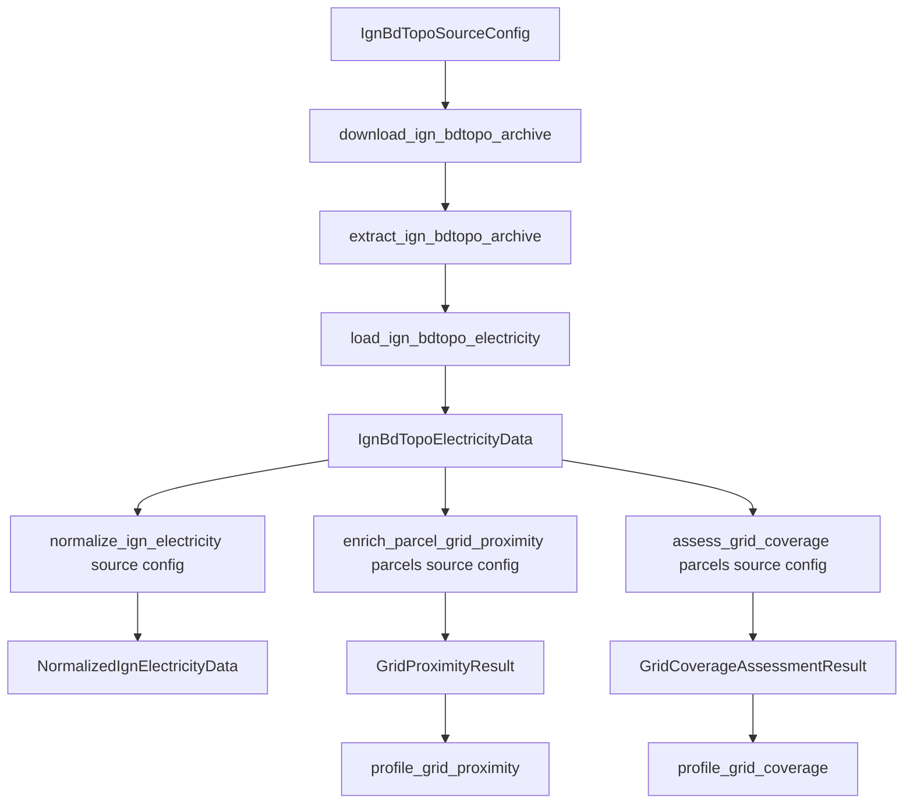

# Grid pipeline

## Implemented flow

## Physical IGN source

The frozen checked-in IGN configuration identifies exact BD TOPO D031 download lineage and logical match rules for an electric-line layer, a transformation-post layer, road access, and department coverage. All four physical roles must be globally distinct. `load_ign_bdtopo_electricity` reconstructs the config model, validates complete archive/extraction/config lineage, and reproduces configured line/post roles from the verified GeoPackage inventory. It reads both layers in one verified batch, with GeoPackage hash checks before and after access, and returns frames plus deterministic `IgnBdTopoLayerSummary` objects.

An IGN transformation post is an IGN mapped feature. It is not an RTE connection node, an offered substation bay, or proof that the feature can accept a BESS connection.

## Source-complete normalization

`normalize_ign_electricity(source, config)` validates exact public types and calls a config-aware physical revalidator. Fresh configured line/post frames and summaries are exact-compared with the supplied source, so a coherent object for another physical layer cannot pass. Context, lineage, summaries, and normalized rows are derived from the returned fresh object only; a later mutation of the supplied object cannot reach output.

Normalization creates stable identities and factual lineage while preserving row order, geometry, CRS, Z coordinates, and null/empty/invalid rows. It maps the declared source attributes into a fixed output schema rather than retaining every arbitrary source column. Output includes separate electric-line and polygonal transformation-post GeoDataFrames with deterministic column order and RangeIndex.

### Voltage parsing

`parse_ign_voltage` interprets only the coded source voltage representation required by the normalizer:

- positive finite text matching `number kV` becomes exact kilovolts/status; decimal points or commas are supported;
- text matching `< number kV` becomes an exclusive upper-bound value with `BELOW` status, not an exact voltage;
- de-energized/unknown/unexpected/malformed values receive explicit statuses;
- source asset status is not overwritten;
- nonfinite values never become numeric voltage output; bare numeric scalars, arbitrary ranges, malformed and unsupported scalar/list-like values are not inferred into exact voltage evidence.

Transformation posts always receive `voltage_status=UNKNOWN` and null voltage; the source schema does not supply a post voltage for this normalizer.

The parser is a factual vocabulary normalizer, not a capacity or compatibility model.

## Public proximity boundary

`enrich_parcel_grid_proximity(parcels, electricity_source, source_config)` accepts verified `IgnBdTopoElectricityData`, not normalized caller frames. It invokes source-complete normalization exactly once, validates parcels and normalized catalogs, rejects every pre-existing parcel column that it would generate, and then calls a private frame-computation helper.

For each parcel it computes:

- nearest electric-line proxy distance and representative/tie identity;
- nearest transformation-post proxy distance and representative/tie identity;
- department, edition, and archive-SHA lineage for selected features (the richer normalized catalog owns provider/product/layer lineage);
- one global nearest exact-voltage line and line-only views for every exact voltage level found among valid normalized lines;
- `VoltageLevelCoverage` counts indicating what source evidence was available.

## Nearest-feature algorithm

1. Validate parcel IDs, Polygon/MultiPolygon geometry, active geometry, CRS, and source facts.
2. Make EPSG:2154 force-2D calculation copies; never replace stored parcel/source geometry.
3. Select only rows whose geometry contract permits distance.
4. Build Shapely STRtree indexes.
5. Use `query_nearest(..., all_matches=True)` so equal nearest features are retained.
6. Calculate finite nonnegative Shapely distances in metres.
7. Sort deterministically by parcel, distance, and lexical feature ID.
8. Retain representative feature fields plus the number of nearest ties. This grid result does not expose a JSON list of all tied feature IDs.
9. Validate that broad and exact-voltage views represent consistent source features.
10. Return copied parcel columns/geometry with a reset RangeIndex and deterministic proximity tables.

At least one valid line and one valid transformation-post polygon must exist. No exact-voltage line is a supported case: the global exact-line fields remain null and the voltage table/coverage tuple are empty. Parcel input uses a valid polygonal spatial envelope and unique IDs; this API does not require the canonical 12-column cadastral schema.

## Coverage boundary

`assess_grid_coverage(parcels, electricity_source, source_config)` owns one public proximity call and one `load_ign_bdtopo_department_coverage(electricity_source.extraction, config)` call. It rejects collisions with every generated coverage/lineage column and validates that coverage is a fresh read of the configured layer/department-field selection from the same verified extraction; a supplied summary cannot choose its own authority.

On calculation copies it evaluates full parcels against the one EPSG:2154 department Polygon/MultiPolygon. Strictly interior parcels receive a distance to the coverage boundary. Touching/crossing/outside parcels receive zero and an outside/crossing position. For a matched grid feature:

- nearest distance less than boundary margin -> `NOT_BOUNDARY_LIMITED`;
- nearest distance equal to or greater than margin -> `BOUNDARY_LIMITED`;
- outside/crossing -> `OUTSIDE_OR_CROSSING_COVERAGE`;
- no selected feature -> `NO_MATCH` with precedence.

Coverage diagnosis warns about the finite verified package boundary. It does not search outside D031 or prove a global nearest feature.

IGN extraction is part of this source boundary: a pre-existing extraction `.bak` stops the run for manual recovery, `.part` must be link/junction-safe, the full Windows-compatible 7z destination inventory is validated before extraction, and actual extracted entries are exact-compared before publication.

## RTE / ODRÉ role

The RTE/ODRÉ adapter independently acquires configured official GeoJSON datasets and preserves metadata/geometry evidence. It does not replace the IGN transformation-post proxy with an RTE connection node inside this current proximity pipeline, and no code equates the two.

## Profiling

`profile_grid_proximity` and `profile_grid_coverage` validate existing result contracts and return count/quantile dataclasses. Profiling does not change rows, set thresholds, or decide feasibility.

## Explicit non-goals

Distance does not prove capacity, voltage compatibility for a project, ownership, connection point availability, queue status, network reinforcement, cost, schedule, feasibility, authorization, or a parcel score.
