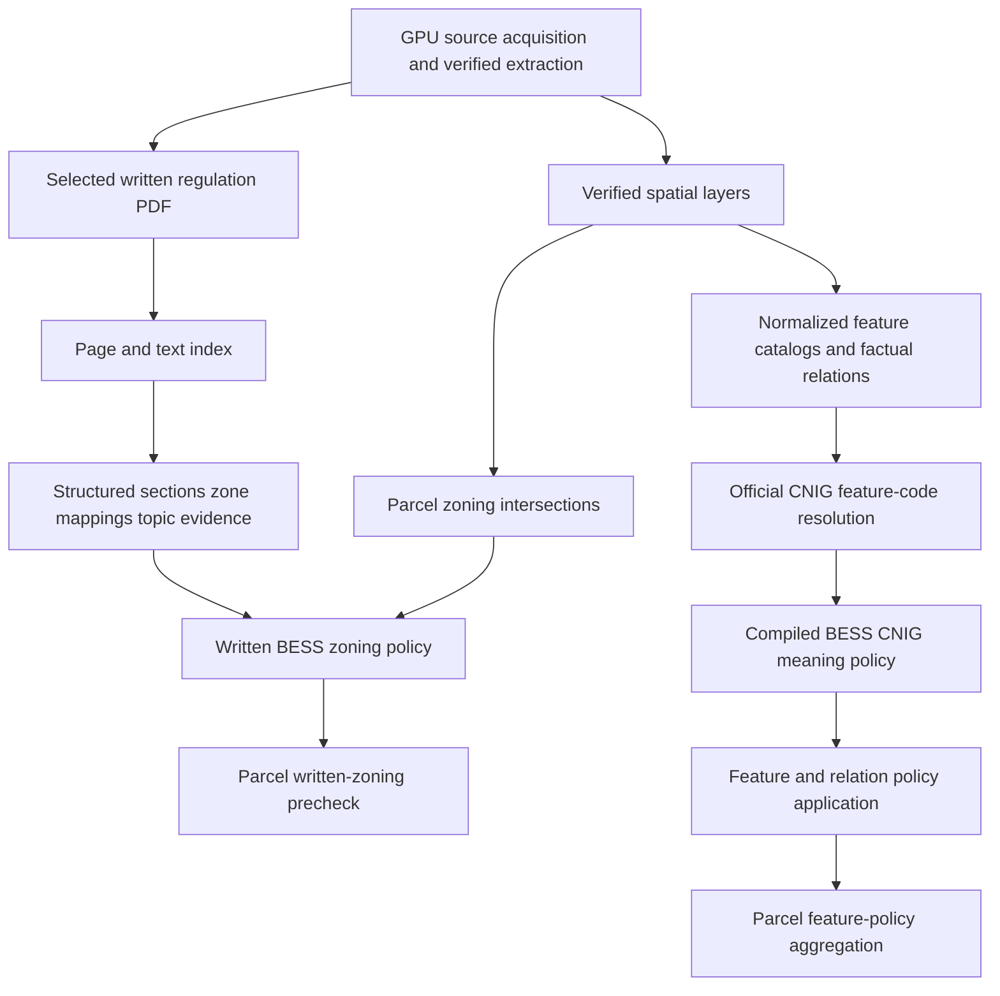

# Planning pipeline

## Separation of evidence layers

The planning implementation intentionally keeps five layers distinct:

1. **FACT** — physical GPU archive/files/layers, source feature attributes/geometries, parcel-zone and parcel-feature relations.
2. **SOURCE TEXT** — exact bytes, pages, records, offsets, and raw excerpts from the selected written regulation PDF.
3. **STRUCTURED EVIDENCE** — deterministic headings, sections, zone mappings, topic flags, and exact source spans.
4. **POLICY INTERPRETATION** — checked-in, source-locked written-zoning or CNIG-meaning rules.
5. **PARCEL-LEVEL PRECHECK** — deterministic application/aggregation of those rules, still not a legal conclusion.

The written-zoning result and feature-policy aggregation are not combined with one another or with grid, road, environment, access, scoring, or rejection by current code.

## GPU acquisition and inspection

`load_gpu_source_config` revalidates exact official API origin, pilot partition, logical spatial roles, and cache policy. `discover_current_gpu_document` queries the partition, selects the unique current PLU document for the configured commune/type/status, validates official archive and written-file URLs, and returns `GpuDocumentMetadata`.

`download_gpu_document` revalidates caller-supplied document metadata and every written-file identity before network/cache access. Cache/ZIP checks bind physical bytes to the document. `extract_gpu_document` validates all members before manual extraction and inventories every file. Spatial discovery/inspection identifies actual dataset layers and returns summaries and `GpuValidatedSpatialLayerSource` integrity envelopes. `ingest_gpu_planning_document` packages extraction, inspected logical layers, written-file records, and source identity into `GpuPlanningDocument`.

## Zoning spatial facts

`intersect_parcels_with_gpu_zoning(parcels, planning_document)`:

1. validates exact input types and parcel geometry;
2. source-completely reloads/normalizes the zoning layer from its validated GPU source;
3. validates canonical zone identity/text/geometry/lineage;
4. projects calculation copies to EPSG:2154;
5. obtains candidate parcel-zone pairs and computes polygon intersections;
6. records intersection area, parcel share, zone share, source zone identity, and lineage;
7. creates deterministic parcel summaries;
8. validates the rebuilt result and preserves source inputs.

`ParcelZoningResult` is factual spatial evidence. A zone label or overlap alone is not a BESS decision.

## Planning feature spatial facts

`intersect_parcels_with_gpu_planning_features` loads surface, line, and point GPU logical layers, normalizes each into canonical catalogs, and constructs factual relations:

- surface: `AREA_OVERLAP` or `TOUCH_ONLY`;
- line: `LENGTH_OVERLAP` or `TOUCH_ONLY`;
- point: `INSIDE` or `BOUNDARY_TOUCH`.

The stage validates feature identity, global uniqueness, source type/subtype values, raw text fields, document/archive lineage, exact role-specific geometry, metrics/counts, parcel area, relation metric/null patterns, relation-to-feature agreement, and parcel summaries. It rebuilds from physical GPU sources for source-complete validation; intrinsic relation validation alone does not reread files.

## Written regulation index

`index_planning_regulation(planning_document)` identifies the authoritative written regulation file from GPU written-file evidence. It validates file containment/identity/hash, reads PDF pages, preserves raw page text, creates deterministic records/spans, and hashes component/source/result content. The index is a source-text artifact. `search_planning_regulation` normalizes query/text through `planning_text` mappings and returns exact raw-context spans; it does not interpret legal meaning.

## Regulation structure

`load_planning_regulation_structure_config` loads exact document/profile locks, layout/header/footer patterns, structural heading grammars, zone aliases, and topic terms. `structure_planning_regulation`:

1. validates the index and zoning inputs/source locks;
2. filters configured page headers/footers without altering body source records;
3. classifies general, zone, article, TOC, continuation, blank, and other records under non-ambiguous grammar;
4. preserves a lossless ordered record partition;
5. creates deterministic multi-page sections and parent/article links;
6. maps exact zone aliases under configured longest/token-boundary rules;
7. derives topic-evidence flags/scope from exact configured terms and section type;
8. carries exact page/offset/hash lineage and validates hashes/result closure.

`PlanningRegulationStructureResult` is structured evidence, not a legal conclusion. `planning_regulation_section_page_fragments` exposes exact source fragments needed by policy validation.

## Written BESS zoning policy

`configs/planning/muret_bess_zoning_policy.yaml` is a source-locked, schema-v5 profile. `load_bess_zoning_policy_config` rejects duplicate keys, unsupported versions, source-lock drift, malformed references, unclosed routes, invalid evidence direction/kind, and noncanonical source excerpts/hashes. The current profile is `muret_bess_written_zoning_v6`.

`interpret_bess_zoning` source-completely validates structure/zoning inputs, verifies every configured evidence occurrence against exact PDF-derived fragments, evaluates configured chapter routes, maps source zones to chapter decisions, applies those decisions to parcel zoning relations, and returns hashed frames/scalars under `BessZoningPrecheckResult`.

The current `CONDITIONAL_REVIEW` outcomes retain unresolved category/ICPE applicability and infrastructure/restriction/exception evidence. `CONTEXT_ONLY` evidence stays visible but cannot qualify a route. No code claims that BESS is categorically an ICPE use or that a route's condition is satisfied.

## CNIG official feature-code resolution

`configs/planning/cnig_plu_2017_feature_codes.yaml` contains the approved schema-v2 CNIG PLU v2017 code dictionary and official references. `resolve_planning_feature_codes` validates the source-complete normalized feature result, exact nonempty dictionary, deterministic unique family/type/subtype pairs, official row/profile semantics, and source hashes. It appends official code status/meaning to catalogs/relations while preserving the factual prefix and geometry.

`RESOLVED_OFFICIAL` requires exact official meaning/reference/source URL fields. `UNKNOWN_CODE_PAIR` retains true null meaning fields and explicit unknown status. The resolver never falls back across family or type-only matches.

## BESS CNIG feature policy

`configs/planning/muret_bess_cnig_feature_policy.yaml` compiles only official CNIG code meaning under `OFFICIAL_CNIG_CODE_MEANING_ONLY`. `compile_bess_planning_feature_policy` validates exact source locks, pair completeness/equality with the coded dictionary, official meaning agreement, status/confidence/priority domains, status-priority bijection, required rationale/action/limitations, and false interpretation/legal flags.

`BessPlanningFeaturePolicyResult` does not inspect local `TXT`, `LIBELLE`, `NOMFIC`, or regulation content and does not establish authorization/prohibition.

## Feature policy application

`apply_bess_planning_feature_policy(coded_result, policy_result)` first validates both lightweight envelopes and compatibility, then deterministically appends policy evidence to every feature and relation while preserving exact canonical factual/CNIG prefixes, dtypes, index, CRS, geometry, row order, source lineage, and relation agreement. Unreferenced features are validated too.

The source-bound artifact loader requires both upstream results, verifies manifest locks before Parquet reads, verifies physical bytes, validates the local envelope, rebuilds once from exact upstream results, and exact-compares all scalars/frames. It performs no GPU reread; independent source-complete validation remains separate.

## Parcel aggregation

`aggregate_bess_planning_feature_policy_to_parcels(source_parcels, application_result)` validates parcels, application relations, real parcel metric areas, local domains, JSON identity collections, and source locks. It creates relation assessments and deterministic parcel summaries. No-relation parcels remain represented and cannot use textual-null IDs.

The aggregation artifact loader requires exact source parcels and application result, verifies physical artifacts/local envelope, rebuilds from those upstream inputs, and exact-compares both frames/scalars. It does not reconstruct GPU intersections or combine another LandScout criterion.

## Schemas and hashes

Current exact schema families are documented in companions. Notable contracts include PlanningFeatureCodeResult schema 5, BESS feature policy result schema 1, application result/manifest schema 2, aggregation result/manifest schema 1, written regulation index/structure/policy/result versions fixed by their modules/configs, and canonical content hashes over explicit frame/scalar payloads. Schema/hash version changes are compatibility changes, not formatting changes.

## Explicit non-goals

The planning pipeline does not provide legal advice, planning permission, prohibition, automatic parcel rejection, ranking, a score, owner/contact information, or a combined multi-criterion BESS decision.
