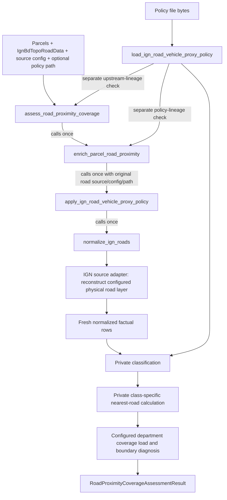

# Road pipeline

## Implemented flow

These arrows distinguish public calls from their internal data flow: the public application does **not** accept caller-normalized rows or a compiled policy, proximity does not accept a caller application result, and assessment does not accept a caller proximity result. Each public entry owns its upstream calls. The same policy path is reloaded at each relevant boundary; inconsistent file bytes are rejected through policy SHA lineage comparison rather than silently combining policies.

## Source-complete road normalization

`load_ign_bdtopo_roads(extraction, config)` reconstructs the immutable config, validates complete download/extraction/config lineage and global uniqueness across the four configured roles, discovers the physical road layer from configured access match tokens, reads a fresh physical frame, and creates a summary. The summary is evidence, not authority for choosing its own layer.

`normalize_ign_roads(source, config)` asks the config-aware loader for a fresh expected road result and exact-compares the supplied frame/summary. It derives context, lineage, and normalized rows from that returned fresh object only, then creates:

- `road_feature_id = IGN_BDTOPO:ROAD_SEGMENT:<cleabs>`;
- `road_feature_type = ROAD_SEGMENT`;
- source package/layer/department/edition/version/timestamp/archive/URL lineage;
- direct raw projections of IGN nature, importance, fictitious state, asset state, lane/width/private/direction/urban/speed/light-vehicle access, closures/restrictions, management, source identifiers/dates, and planimetric fields;
- `spatial_role` and `geometry_status`;
- unchanged geometry under EPSG:2154.

`cleabs` must be exact, nonempty, unique, edge-whitespace-free, colon-free, and control-character-free. The stage does not translate the raw access/restriction values. Valid geometry must be LineString/MultiLineString. Null, empty, and invalid geometry remain as rows with explicit status; no repair/drop occurs.

## Vehicle-proxy policy

`configs/access/ign_bdtopo_vehicle_proxy_policy.yaml` is loaded and strictly compiled by `load_ign_road_vehicle_proxy_policy`. Policy identity, schema, reference evidence, source vocabularies, output classes, exact rule outcomes, and precedence are byte-hash bound. Current scope is official IGN general-car/light-vehicle routing evidence only; heavy vehicle access is `NOT_PROVEN`.

The application evaluates valid geometry under exact precedence:

1. `FICTITIOUS_GEOMETRY`
2. `PROJECT_GEOMETRY_NOT_SIGNIFICANT`
3. `NOT_IN_SERVICE`
4. `PHYSICALLY_IMPOSSIBLE`
5. `NON_GENERAL_VEHICLE_NATURE`
6. `RIGHTS_RESTRICTED`
7. `PRIVATE_ROAD`
8. `TEMPORAL_CLOSURE`
9. `KNOWN_RESTRICTION`
10. `OTHER_RECORDED_RESTRICTION`
11. `SPECIAL_NATURE`
12. `LIMITED_NATURE`
13. `IMPORTANCE_6`
14. `NARROW_CARRIAGEWAY`
15. `OPEN_OR_TOLL`
16. `UNKNOWN`

Non-valid geometry is handled first by the technical `SOURCE_GEOMETRY_NOT_VALID` gate and `NOT_DISTANCE_PROXY`; it is not a business rule. Strict scalar parsers do not use Python truthiness or string coercion. Unknown critical fields remain explicit, and `OPEN_OR_TOLL` cannot hide them.

Application appends primary rule, class, canonical complete rule trace, deterministic unknown-field list, toll evidence, and policy lineage. It preserves every factual prefix column, dtype, index, CRS, row, raw value, and geometry WKB.

## Proxy classes

Current approved classes are `GENERAL_VEHICLE_PROXY`, `LIMITED_VEHICLE_PROXY`, `RESTRICTED_REVIEW`, `NOT_GENERAL_VEHICLE_PROXY`, `NOT_DISTANCE_PROXY`, and `UNKNOWN_REVIEW`. These describe general-car/light-vehicle source evidence, not legal/heavy/BESS access.

## Parcel proximity

`enrich_parcel_road_proximity(parcels, road_source, source_config, policy_path)` owns one source-complete application call and validates its policy/source lineage. For each distance-eligible class it:

1. selects valid road geometries of that exact class;
2. builds one STRtree;
3. queries full EPSG:2154 parcel geometry with `all_matches=True`;
4. retains finite nonnegative distance and all exact nearest ties;
5. chooses a deterministic lexical representative;
6. repeats source road/policy lineage in a fixed class-proximity table.

`NOT_DISTANCE_PROXY` remains in all six `RoadProxyClassCoverage` counts but has no proximity rows/index. Each of the five currently approved eligible classes has one row per parcel, even when that class is absent from this source package: distance, tie count and selected evidence are then null. Output order is input parcel order followed by policy class order. Calculation copies are transformed from stored parcel EPSG:4326 to EPSG:2154 and forced to XY; original parcel geometry, index, dtypes and facts remain unchanged. A nonempty class gets one STRtree, not an index per parcel. Ties are exact nearest matches returned by GEOS, not a tolerance band.

## Coverage diagnostics

`assess_road_proximity_coverage` invokes the public proximity chain exactly once, validates its unchanged parcels/class table, loads configured department coverage from the same road extraction exactly once, and appends per-parcel boundary position/distance and per-class status. `NO_MATCH` wins over geometry position; equality of nearest-road distance and source-boundary margin is boundary-limited.

The output preserves the original proximity prefix exactly and returns the unchanged source coverage object for auditability. It does not build another road STRtree or reconstruct road distances.

Full coverage means the department geometry covers the entire parcel and its boundary does not intersect the parcel. Touching, crossing and wholly outside parcels all receive `OUTSIDE_OR_CROSSING_COVERAGE` and zero boundary margin. A matched fully covered parcel is `NOT_BOUNDARY_LIMITED` only when road distance is strictly below that margin; equality is `BOUNDARY_LIMITED`. This diagnoses the package's search boundary, not global road completeness or access. Final validation recomputes the boundary diagnostics but does not rerun road nearest-neighbour search.

The policy/config trust objects are deeply immutable; result dataclasses freeze field reassignment only. Their GeoDataFrames and DataFrames remain mutable results, so downstream public boundaries still perform their documented reconstruction and validation. Unit proximity tests replace the application stage; coverage tests replace both upstream proximity and the physical department loader. Their synthetic geometry assertions are not additional independent real-source audits.

The road and coverage source paths share the hardened IGN extraction contract: pre-existing `.bak` recovery material fails closed, temporary extraction paths are link/junction-safe, 7z destinations are validated under Windows-compatible rules before extraction, and the actual inventory is verified before transactional publication.

## Explicit non-goals

Road geometry is not a right of way, parcel entrance, easement, public-highway status, or legal access. General-car/light-vehicle proxy evidence is not heavy-truck, exceptional-convoy, fire-service, construction, or BESS transport proof. Proximity does not define an acceptable threshold, parcel score, ranking, rejection, or authorization.
