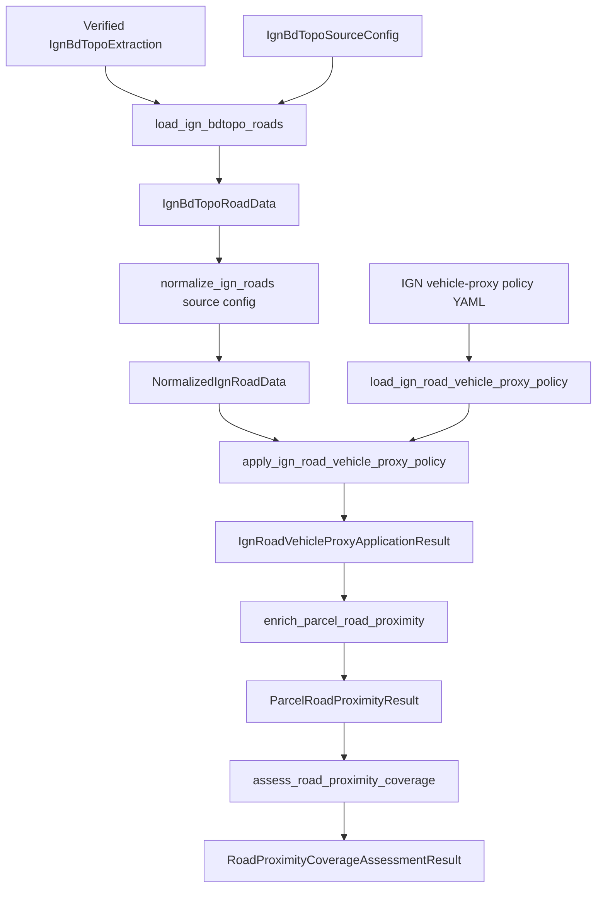

# Road pipeline

## Implemented flow

## Source-complete road normalization

`load_ign_bdtopo_roads(extraction, config)` discovers the physical road layer from configured access match tokens, validates the same extraction/GeoPackage contract used by other IGN consumers, reads the physical frame, and creates a summary. The summary is evidence, not authority for choosing its own layer.

`normalize_ign_roads(source, config)` asks the config-aware loader for a fresh expected road result and exact-compares the supplied frame/summary. It then creates:

- `road_feature_id = IGN_BDTOPO:ROAD_SEGMENT:<cleabs>`;
- `road_feature_type = ROAD_SEGMENT`;
- source package/layer/department/edition/version/timestamp/archive/URL lineage;
- direct raw projections of IGN nature, importance, fictitious state, asset state, lane/width/private/direction/urban/speed/light-vehicle access, closures/restrictions, management, source identifiers/dates, and planimetric fields;
- `spatial_role` and `geometry_status`;
- unchanged geometry under EPSG:2154.

`cleabs` must be exact, nonempty, unique, edge-whitespace-free, colon-free, and control-character-free. The stage does not translate the raw access/restriction values. Valid geometry must be LineString/MultiLineString. Null, empty, and invalid geometry remain as rows with explicit status; no repair/drop occurs.

## Vehicle-proxy policy

`configs/access/ign_bdtopo_vehicle_proxy_policy.yaml` is loaded and strictly compiled by `load_ign_road_vehicle_proxy_policy`. Policy identity, schema, reference evidence, source vocabularies, output classes, exact rule outcomes, and precedence are byte-hash bound. Current scope is official IGN general-car/light-vehicle routing evidence only; heavy vehicle access is `NOT_PROVEN`.

The application evaluates valid geometry under exact precedence:

1. `FICTITIOUS_GEOMETRY`
2. `PROJECT_GEOMETRY_NOT_SIGNIFICANT`
3. `NOT_IN_SERVICE`
4. `PHYSICALLY_IMPOSSIBLE`
5. `NON_GENERAL_VEHICLE_NATURE`
6. `RIGHTS_RESTRICTED`
7. `PRIVATE_ROAD`
8. `TEMPORAL_CLOSURE`
9. `KNOWN_RESTRICTION`
10. `OTHER_RECORDED_RESTRICTION`
11. `SPECIAL_NATURE`
12. `LIMITED_NATURE`
13. `IMPORTANCE_6`
14. `NARROW_CARRIAGEWAY`
15. `OPEN_OR_TOLL`
16. `UNKNOWN`

Non-valid geometry is handled first by the technical `SOURCE_GEOMETRY_NOT_VALID` gate and `NOT_DISTANCE_PROXY`; it is not a business rule. Strict scalar parsers do not use Python truthiness or string coercion. Unknown critical fields remain explicit, and `OPEN_OR_TOLL` cannot hide them.

Application appends primary rule, class, canonical complete rule trace, deterministic unknown-field list, toll evidence, and policy lineage. It preserves every factual prefix column, dtype, index, CRS, row, raw value, and geometry WKB.

## Proxy classes

Current approved classes are `GENERAL_VEHICLE_PROXY`, `LIMITED_VEHICLE_PROXY`, `RESTRICTED_REVIEW`, `NOT_GENERAL_VEHICLE_PROXY`, `NOT_DISTANCE_PROXY`, and `UNKNOWN_REVIEW`. These describe general-car/light-vehicle source evidence, not legal/heavy/BESS access.

## Parcel proximity

`enrich_parcel_road_proximity(parcels, road_source, source_config, policy_path)` owns one source-complete application call and validates its policy/source lineage. For each distance-eligible class it:

1. selects valid road geometries of that exact class;
2. builds one STRtree;
3. queries full EPSG:2154 parcel geometry with `all_matches=True`;
4. retains finite nonnegative distance and all exact nearest ties;
5. chooses a deterministic lexical representative;
6. repeats source road/policy lineage in a fixed class-proximity table.

`NOT_DISTANCE_PROXY` remains in `RoadProxyClassCoverage` counts but has no proximity rows/index. Empty future eligible classes yield explicit no-match rows rather than disappearing.

## Coverage diagnostics

`assess_road_proximity_coverage` invokes the public proximity chain exactly once, validates its unchanged parcels/class table, loads configured department coverage from the same road extraction exactly once, and appends per-parcel boundary position/distance and per-class status. `NO_MATCH` wins over geometry position; equality of nearest-road distance and source-boundary margin is boundary-limited.

The output preserves the original proximity prefix exactly and returns the unchanged source coverage object for auditability. It does not build another road STRtree or reconstruct road distances.

## Explicit non-goals

Road geometry is not a right of way, parcel entrance, easement, public-highway status, or legal access. General-car/light-vehicle proxy evidence is not heavy-truck, exceptional-convoy, fire-service, construction, or BESS transport proof. Proximity does not define an acceptable threshold, parcel score, ranking, rejection, or authorization.
