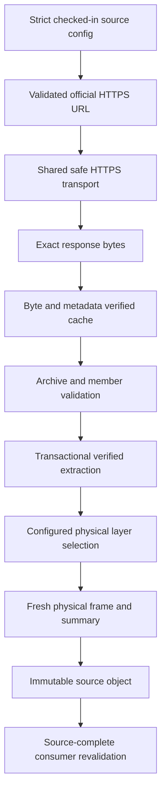

# Source trust model

## Core rule

LandScout distinguishes a self-consistent in-memory object from evidence that corresponds to an approved physical source. A provider string, URL, archive name, SHA-looking value, logical layer, or source-document ID is textual lineage. A source-complete boundary additionally validates the configured identity, exact physical bytes, archive/extraction structure, physical layer selection, and—where required—freshly reread frame contents.

## Shared HTTPS boundary

`landscout.common.safe_http.open_safe_https` is the only outbound transport used by current Cadastre, RTE/ODRÉ, IGN, GPU, and INPN adapters.

1. It accepts only an HTTPS URL without credentials or unsafe hostname forms.
2. Literal/numeric IP addresses are parsed strictly and must be globally routable.
3. Ordinary hostnames are resolved with `socket.getaddrinfo`; all usable returned addresses must be public/global. A mixed public/private answer fails closed.
4. Resolver records are parsed into immutable `_ResolvedAddress` values.
5. `_BoundHTTPSConnection` creates a socket for one validated numeric address; it does not ask the socket layer to resolve the hostname again.
6. The peer address is compared with the selected validated address.
7. A default verifying TLS context wraps the socket with the original hostname as SNI/certificate identity.
8. HTTP `Host` uses the original canonical hostname and optional non-default port. Caller-supplied `Host` is forbidden and header names are token-validated.
9. Environment proxy settings are bypassed because the implementation uses the numeric bound socket directly.
10. Redirects are manual, finite, loop-detected, and each target repeats the complete validation before its request.
11. Only final 2xx responses are exposed; `SafeHttpsResponse` streams bytes and owns response/connection cleanup.

The transport proves an outbound HTTPS exchange reached one address from the validated DNS snapshot under the requested hostname's TLS identity. It does not know dataset IDs, expected file hashes, archive formats, or business semantics; adapters add those checks.

## Cadastre

- The official parcels URL is derived from an exact canonical commune code.
- The download result binds URL, timestamp, filename, physical size, SHA256, cache path, and cache-hit state.
- Cached bytes must match the sidecar, freshness rule, source URL, physical size/SHA, and valid gzip structure.
- `load_cadastre_parcels` consumes an exact `CadastreDownload`, rechecks physical archive integrity before parsing, validates the GeoJSON/geometry contract, and rechecks size/SHA afterward to detect read-time replacement.
- Normalized parcel lineage is copied from the validated download. A caller cannot establish this trust merely by constructing matching strings in a GeoDataFrame.

## RTE / ODRÉ

- `configs/sources/rte_odre_fr.yaml` fixes the exact official API origin/path and three logical dataset IDs.
- In-memory config is revalidated before URL construction/network access, preventing mutation to another origin.
- Metadata and GeoJSON export URLs are built from the configured dataset ID.
- Download validates JSON structure, geometry coordinate finiteness/shape recursively, export counts, physical size/SHA, metadata result fields, and cache sidecar.
- The adapter preserves source metadata precision: unavailable metadata values remain unavailable rather than being fabricated.

## IGN BD TOPO

- Configuration fixes provider/product/department/edition/version/projection/package/archive identity, official source/checksum URLs, checksum/size locks, and logical role selection rules.
- Download verifies the pinned archive checksum/size and source metadata; cache reuse rehashes bytes.
- Extraction accepts the expected GeoPackage package shape, inventories physical layers, and stores a marker binding archive and GeoPackage bytes.
- `_validate_extraction_envelope` checks marker, paths, inventory, roles, source archive, and current GeoPackage size/SHA. Verified layer reads hash before and after batched physical access.
- Config-aware loaders reproduce electricity line/post, road, and department coverage roles from `IgnBdTopoSourceConfig`; source summaries are not allowed to select their own authoritative layer.
- Grid and road normalizers call config-aware fresh loaders and exact-compare supplied versus physical frames, columns, dtypes, index, CRS, geometry WKB, attrs, and summaries.
- Coverage objects are bound to the same extraction object/configured layer and department field before diagnostic use.

## GPU

- Configuration locks the official GPU API origin, pilot commune/document type, partition request, cache roots, and logical spatial-layer match rules.
- Current-document discovery validates response structure, exact commune/document status/identity, official document-specific archive URL, and official per-written-file URL provenance.
- Caller-supplied `GpuDocumentMetadata` is revalidated, including every written-file item, before cache/network use.
- Archive cache binds document identity, selected source URL, byte size, SHA256, ZIP structure, and strict sidecar.
- ZIP validation rejects traversal, absolute paths, normalized/case collisions, Windows reserved/forbidden names, symlinks/special files, duplicate destinations, file-directory conflicts, and marker collisions before extraction.
- Extraction inventory binds every regular file's relative path, size, SHA, category, and archive identity; publication is transactional.
- Spatial inspection identifies actual layers and summaries, then `GpuValidatedSpatialLayerSource` binds each source file/layer to physical file integrity.
- Planning consumers call GPU revalidation helpers that reread/compare current physical layers rather than accepting textual lineage alone.

## INPN / PatriNat

- The checked-in config fixes PatriNat, MNHN, INPN, dataset `EP`, declared version `07/2026`, official reference/archive URLs, filename, expected size 99,835,011, and SHA256 `73688bc37205a5e7f59e2065a0b81fc8cf2a242bdec5d7d2786f083671c4abe5`.
- Cold download and cache reuse require exact configured size/SHA plus strict schema-v1 sidecar equality.
- ZIP validation examines the complete inventory before manual extraction and rejects traversal, platform collisions, links/special files, encryption, and unsafe destinations.
- The schema-v1 extraction marker binds archive SHA/size and a lexically ordered full regular-file inventory. Cache reuse rescans and rehashes every file and rejects missing, modified, renamed, extra, linked, or special entries.
- The current chain stops at factual inventory; it does not open a protected-area GeoPackage in a production analysis stage.

## Cache recovery as trust state

A `.bak` file/link/junction means automatic publication/rollback did not conclusively restore the prior state or an operator intentionally retained recovery material. Relevant adapters fail before cache reuse or network rather than deleting it. See [CACHE_AND_RECOVERY.md](CACHE_AND_RECOVERY.md).

## Result-envelope trust

Planning code exposes two distinct validation levels:

- Lightweight envelope validators check exact type, schema versions, scalars, frame schemas/semantics, component hashes, and complete hashes without rereading GPU files or reconstructing spatial relations.
- Source-complete validators additionally validate against their physical/upstream sources.

Application and aggregation artifact loaders require upstream result objects, run lightweight validation, compare cheap manifest locks before reads, verify physical Parquet bytes, validate the local envelope, deterministically rebuild from exact upstream inputs, and exact-compare scalars/frames. Independent source-complete validation remains a separate deeper operation.

## What trust does not mean

Byte/source trust says evidence corresponds to the configured source snapshot and contract. It does not certify source correctness in the real world, current legal status, engineering capacity, road rights, owner identity, planning authorization, environmental suitability, or BESS feasibility.
