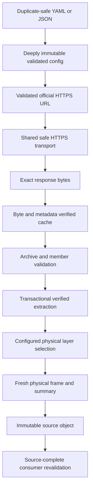

# Source trust model

## Core rule

LandScout distinguishes a self-consistent in-memory object from evidence that corresponds to an approved physical source. A provider string, URL, archive name, SHA-looking value, logical layer, or source-document ID is textual lineage. A source-complete boundary additionally validates the configured identity, exact physical bytes, archive/extraction structure, physical layer selection, and—where required—freshly reread frame contents.

## Strict serialization and immutable configuration

Trust-bearing YAML is decoded through the shared SafeLoader-based parser, which rejects duplicate keys at every mapping depth. Trust-bearing JSON is decoded as strict UTF-8 and rejects duplicate object keys, non-finite numbers, float overflow, malformed text, and non-object top-level values where a model/manifest requires an object. Pydantic validation still owns each source-specific schema after parsing.

Decision-input configuration, profile, and policy models are frozen. Nested mappings and collections are converted to immutable forms where freezing a Pydantic shell would otherwise leave mutable state. Public source boundaries reconstruct and validate exact models from canonical dumps before using their authority; a caller-mutated or forged model copy cannot become source identity merely because it has the expected class.

## Shared HTTPS boundary

`landscout.common.safe_http.open_safe_https` is the only outbound transport used by current Cadastre, RTE/ODRÉ, IGN, GPU, and INPN adapters.

1. It accepts only an HTTPS URL without credentials or unsafe hostname forms.
2. Literal/numeric IP addresses are parsed strictly and must be globally routable.
3. Ordinary hostnames are resolved with `socket.getaddrinfo`; all usable returned addresses must be public/global. A mixed public/private answer fails closed.
4. Resolver records are parsed into immutable `_ResolvedAddress` values.
5. `_BoundHTTPSConnection` creates a socket for one validated numeric address; it does not ask the socket layer to resolve the hostname again.
6. The peer address is compared with the selected validated address.
7. A default verifying TLS context wraps the socket with the original hostname as SNI/certificate identity.
8. HTTP `Host` uses the original canonical hostname and optional non-default port; the transport owns `Host` and `Connection: close`.
9. Caller headers are case-insensitively unique. `Authorization`, `Proxy-Authorization`, `Cookie`, `Cookie2`, and caller-owned hop-by-hop headers are rejected before DNS, so redirects cannot forward them. Ordinary `User-Agent` and `Accept` may cross a validated redirect.
10. Environment proxy settings are bypassed because the implementation uses the numeric bound socket directly.
11. Redirects are manual, finite, loop-detected, and each target repeats the complete validation before its request.
12. Only final 2xx responses are exposed; `SafeHttpsResponse` streams bytes and owns response/connection cleanup.

The transport proves an outbound HTTPS exchange reached one address from the validated DNS snapshot under the requested hostname's TLS identity. It does not know dataset IDs, expected file hashes, archive formats, or business semantics; adapters add those checks.

## Cadastre

- The official parcels URL is derived from an exact canonical commune code.
- The download result binds canonical commune code, exact official HTTPS URL/filename, timestamp, physical size, SHA256, cache path, and cache-hit state.
- Cached bytes must match the strict sidecar schema, freshness rule, official commune/source identity, physical size/SHA, and valid gzip structure.
- `load_cadastre_parcels` returns `CadastreParcelSource`, retaining the exact validated `CadastreDownload` beside the parsed GeoDataFrame.
- `revalidate_cadastre_parcel_source` revalidates official download identity and current bytes, rereads the gzip, exact-compares columns/dtypes/index/CRS/active geometry/non-geometry values/WKB/contractual attrs, and returns the fresh frame.
- `normalize_cadastre_parcels` derives from that fresh frame, accepts only 2D Polygon/MultiPolygon source geometry, and rejects generated-column collisions. Downstream parcel consumers share a canonical validator that recomputes VALID areas in EPSG:2154 and requires INVALID areas to remain null.

## RTE / ODRÉ

- `configs/sources/rte_odre_fr.yaml` fixes the exact official API origin/path and three logical dataset IDs.
- In-memory config is revalidated before URL construction/network access, preventing mutation to another origin.
- Metadata and GeoJSON export URLs are built from the configured dataset ID.
- Download validates JSON structure, geometry coordinate finiteness/shape recursively, export counts, physical size/SHA, metadata result fields, and cache sidecar.
- The adapter preserves source metadata precision: unavailable metadata values remain unavailable rather than being fabricated.

## IGN BD TOPO

- Configuration fixes provider/product/department/edition/version/projection/package/archive identity, official source/checksum URLs, checksum/size locks, and logical role selection rules.
- Download verifies the pinned archive checksum/size and source metadata; cache reuse rehashes bytes.
- Extraction accepts the expected GeoPackage package shape, validates the full Windows-compatible 7z destination inventory before extraction, inventories the resulting physical layers, and stores a marker binding archive and GeoPackage bytes.
- `_validate_extraction_envelope` checks marker, paths, inventory, roles, source archive, and current GeoPackage size/SHA. Verified layer reads hash before and after batched physical access.
- Config-aware loaders reproduce electricity line/post, road, and department coverage roles from `IgnBdTopoSourceConfig`; source summaries are not allowed to select their own authoritative layer.
- Grid and road normalizers call config-aware fresh loaders, exact-compare supplied versus physical frames, columns, dtypes, index, CRS, geometry WKB, attrs, and summaries, then derive output only from the returned fresh objects.
- Coverage objects are bound to the same extraction object/configured layer and department field before diagnostic use.
- All electricity, road, and department logical roles are globally distinct. Existing extraction `.bak` recovery material fails closed and is never automatically discarded; temporary extraction paths are link/junction-safe.

## GPU

- Immutable configuration locks the exact GPU provider/portal/country, official API origin, pilot commune/document type, partition request, cache roots, and logical spatial-layer match rules.
- Current-document discovery validates response structure, exact commune/document status/identity, official document-specific archive URL, and official per-written-file URL provenance.
- Caller-supplied `GpuDocumentMetadata` is revalidated, including every written-file item, before cache/network use.
- Archive cache binds document identity, selected source URL, byte size, SHA256, ZIP structure, and strict sidecar.
- ZIP validation rejects traversal, absolute paths, normalized/case collisions, Windows reserved/forbidden names, symlinks/special files, duplicate destinations, file-directory conflicts, and marker collisions before extraction.
- Extraction inventory binds every regular file's relative path, size, SHA, category, and archive identity; publication is transactional, `.bak` recovery material fails closed, and temporary archive/metadata/extraction paths are link/junction-safe.
- Spatial inspection identifies actual layers and summaries, enforces global uniqueness across every populated logical role, then `GpuValidatedSpatialLayerSource` binds each source file/layer to physical file integrity. Source-complete revalidation freshly rediscovers the complete physical layer inventory and exact-compares it with `GpuPlanningDocument.all_spatial_layers`, so a coordinated in-memory omission cannot narrow the authoritative package.
- `GpuPlanningDocument` retains the validated source config plus its deterministic canonical SHA256. Planning consumers verify that config identity, extraction/config lineage, and physical layer contents rather than accepting provider strings or textual lineage alone.

## INPN / PatriNat

- The checked-in config fixes PatriNat, MNHN, INPN, dataset `EP`, declared version `07/2026`, official reference/archive URLs, filename, expected size 99,835,011, and SHA256 `73688bc37205a5e7f59e2065a0b81fc8cf2a242bdec5d7d2786f083671c4abe5`.
- Cold download and cache reuse require exact configured size/SHA plus strict schema-v1 sidecar equality.
- One exact-size/SHA built-in archive `bytes` snapshot supplies ZIP validation, authoritative uncompressed regular-member hashes, and extraction streams. Member handling rejects traversal, platform collisions, links/special files, encryption, and unsafe destinations without reopening a live archive path.
- Every immutable ZIP snapshot is opened through one controlled context manager; constructor/open failures are translated to `InpnProtectedAreasSourceError` with chained causes rather than leaking raw ZIP exceptions.
- The schema-v1 extraction marker is cache evidence only. Cache/public validation requires archive-derived inventory, marker, freshly hashed physical extraction, and caller tuple to agree exactly, rejecting coordinated marker/file forgery as well as missing, modified, renamed, extra, linked, or special entries.
- Cold publication, extraction-cache reuse, extraction rebuild, and public extraction validation reread the archive path before success. Rebuild checks occur both before and after extraction publication, so a known persistent in-operation mutation cannot yield a stale successful envelope.
- Download lineage requires exact built-in strings, exact integer/boolean scalars, an exact configured path, and a UTC timestamp. `validate_inpn_protected_areas_extraction` reconstructs official text from validated config and size/SHA/path from the verified archive snapshot before returning a fresh source-bound object.
- The metadata-only catalog reads every package path once into verified immutable bytes. `pyogrio.list_layers` and every `read_info` receive that same package snapshot, preventing live-path swap-and-restore metadata injection. Every layer must report exact driver `GPKG`.
- Extraction owns one canonical Windows-compatible relative-path grammar, and catalog/attribute-profile/geometry-profile intrinsic validation delegates to it before accepting package identity. Unsafe reserved, forbidden/control, component-whitespace, trailing-dot/space, traversal/absolute/driven/backslash, and NFKC-hazard forms therefore fail identically at every dependent evidence layer; validation rejects whitespace rather than trimming it, and valid nested `.gpkg`/`.GPKG` spellings are retained exactly. Catalog/profile boundaries translate failures to their public controlled errors with chained causes.
- Only the known dynamic Pyogrio `/vsimem/pyogrio_<hex>` GPKG-extension `RuntimeWarning` is filtered inside the two byte-backed metadata calls; unrelated warnings and driver validation remain active.
- Catalog schema 2 records driver identity in the portable canonical hash and requires exact final tuple/float bounds and exact built-in optional CRS strings.
- `validate_inpn_protected_areas_catalog` validates every intrinsic domain and source lock, independently rebuilds from fresh physical files, and exact-compares the complete result rather than trusting its hash alone.
- The attribute profiler repeats the extraction/catalog authority chain, reads each package once into exact verified bytes, and calls only `pyogrio.read_dataframe(bytes, exact layer, exact fields, read_geometry=False, fid_as_index=True, use_arrow=False, datetime_as_string=True)`. It accepts only an exact non-geospatial Pandas frame, canonicalizes rows by preserved integer FID, retains every exact distinct non-null value/frequency, and binds FID/column/row/profile hashes.
- Attribute-profile validation first proves strict immutable nested records, canonical package/layer/field identities and grouping, exact inclusive FID-range capacity, component-SHA syntax, deterministic empty-component hashes, aggregates, and complete-hash closure. Layer evidence intentionally retains its portable package `relative_path: str`, but no absolute `Path`. It then rejects catalog-bound source/package/layer/field mismatches against the fresh catalog before any attribute read and independently rebuilds non-empty component evidence from current package bytes. A coordinated caller profile/hash mutation cannot override the physical source, a persistent mutation fails final extraction/catalog validation, and a temporary live-path swap cannot alter the captured package snapshot.
- The separate geometry profiler repeats the same extraction/catalog authority chain and gives exact verified package bytes to an in-memory `sqlite3.Connection.deserialize` snapshot. Pyogrio 0.13.0 remains the metadata-catalog reader, but is deliberately excluded from geometry-row materialization because it drops M. Query-only SQLite reads select only the discovered INTEGER PRIMARY KEY FID and geometry BLOB; exact feature-table/geometry metadata, quoted identifiers, and bound metadata values prevent source text from becoming SQL commands. Feature views are unsupported rather than assigned guessed FIDs.
- Geometry BLOBs are exact Standard GeoPackageBinary evidence, not naked WKB. Header validation checks magic/version/flags/envelope/SRS/empty evidence; only embedded WKB reaches Shapely. Parsed XY/XYZ/XYM/XYZM state must respect source Z/M declarations and retain every present finite ordinate. NULL/EMPTY/non-empty and valid/invalid topology remain factual domains with complete reasons and exact observed/catalog bound relations; no repair, coordinate transformation, or semantic category selection occurs.
- The raw geometry BLOB stream and parser-derived canonical WKB stream have separate FID-addressed content hashes. Raw BLOB SHA evidence is toolchain-independent; complete profile identity also binds SQLite/Pyogrio/GDAL/Shapely/GEOS/PyProj versions and the explicit source-dimensional extended little-endian no-SRID encoding contract. Immutable returned records retain no bytes, geometries, database handles, arrays, absolute paths, or mutable collections.
- Geometry intrinsic validation proves canonical structure, types, paths, identities, domain/count closure, bounds, and complete-hash consistency, not the original non-empty raw/parser component hashes. Public validation cheaply rejects fresh-catalog/profile lineage mismatches before geometry-row reads, independently reconstructs every geometry field/hash from immutable bytes, and requires final extraction/catalog equality. Transient physical path swaps cannot change an already-deserialized snapshot; persistent mutation fails before return. Coordinated profile/hash edits cannot override the approved physical source.
- The current chain stops at separate factual EP attribute-value and geometry technical-quality profiles. EP is distinct from the separate Natura 2000 and ZNIEFF reference archives. It does not interpret categories or legal regimes, normalize environmental geometry, or perform parcel analysis.

## Cache recovery as trust state

A `.bak` file/link/junction means automatic publication/rollback did not conclusively restore the prior state or an operator intentionally retained recovery material. Relevant adapters fail before cache reuse or network rather than deleting it. See [CACHE_AND_RECOVERY.md](CACHE_AND_RECOVERY.md).

## Result-envelope trust

Planning code exposes two distinct validation levels:

- Lightweight envelope validators check exact type, schema versions, scalars, frame schemas/semantics, component hashes, and complete hashes without rereading GPU files or reconstructing spatial relations.
- Source-complete validators additionally validate against their physical/upstream sources.

Application and aggregation artifact loaders require upstream result objects, run lightweight validation, compare cheap manifest locks before reads, verify physical Parquet bytes, validate the local envelope, deterministically rebuild from exact upstream inputs, and exact-compare scalars/frames. Independent source-complete validation remains a separate deeper operation.

## What trust does not mean

Byte/source trust says evidence corresponds to the configured source snapshot and contract. It does not certify source correctness in the real world, current legal status, engineering capacity, road rights, owner identity, planning authorization, environmental suitability, or BESS feasibility.
